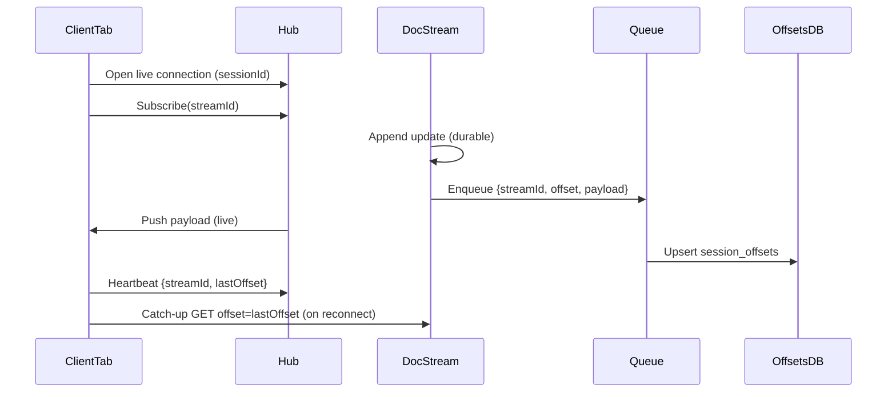

# Hot Push, Cold Catch-Up (Per-Tab Subscriptions)

This design avoids large write amplification while still allowing reliable catch-up.
It pushes full updates live to connected tabs, and persists only tiny “pointers”
per tab so missed updates can be replayed from the source doc streams.

## Goals
- **Live updates** delivered without a second request in the common case.
- **Durable catch-up** when a tab reconnects or misses a push.
- **Minimal write amplification** (store only `{streamId, offset}` pointers).
- **Per-tab** subscriptions (no per-user aggregation).

## Core Idea
1. **Source of truth**: every update is appended once to the document stream.
2. **Live fan-out**: connected tabs get the full payload over SSE/WebSocket.
3. **Durable pointer**: per tab + per doc, store only the latest offset.
4. **Catch-up**: on reconnect, tab reads missing ops from the doc stream.

This makes hot traffic cheap and recovery reliable, without storing full deltas
N times.

## Subscription Handshake (Avoiding Gaps)
To avoid missing updates between subscribe and live connect, use this order:
1. **Open live connection** for the session.
2. **Subscribe** to desired stream ids.
3. **Catch up** from the last known offsets.

If you subscribe before the live connection is established, a doc update could
arrive in the gap and be neither pushed nor caught up.

## Sequence Diagram (Hot Push + Cold Catch-Up)


## Data Model (D1)
```sql
CREATE TABLE session_subscriptions (
  session_id TEXT NOT NULL,
  user_id TEXT NOT NULL,
  stream_id TEXT NOT NULL,
  subscription_epoch INTEGER NOT NULL,
  expires_at INTEGER NOT NULL,
  PRIMARY KEY (session_id, stream_id)
);

CREATE TABLE session_offsets (
  session_id TEXT NOT NULL,
  user_id TEXT NOT NULL,
  stream_id TEXT NOT NULL,
  subscription_epoch INTEGER NOT NULL,
  last_offset TEXT NOT NULL,
  updated_at INTEGER NOT NULL,
  PRIMARY KEY (session_id, stream_id)
);

CREATE INDEX session_offsets_by_session
  ON session_offsets (session_id);
```

Notes:
- `session_id` is a per-tab stable id (e.g., `sessionStorage`).
- `user_id` binds the session to an authenticated identity.
- `subscription_epoch` increments on unsubscribe/resubscribe to prevent stale
  queue deliveries from resurrecting offsets.
- `expires_at` is refreshed via heartbeat (e.g., every 5–10 minutes).
- `last_offset` stores the **latest doc stream offset** seen (or pushed).

## Authentication and Authorization
Per-tab sessions must be **server-minted or signed**. Do not trust arbitrary
client-provided `session_id`.

Recommended pattern:
1. Client authenticates (cookie or bearer token).
2. Server returns a **signed session id** (or a random id stored server-side).
3. All session operations require auth and validate session ownership.

Auth rules:
- **Create session**: authenticated user gets `session_id`.
- **Subscribe/unsubscribe**: validate that the user can access `stream_id`.
- **Live push**: only deliver to connections bound to the session’s user.
- **Offsets**: `GET /v1/session-offsets/<sessionId>` must verify owner.
- **Catch-up**: doc stream reads still enforce stream ACLs.

SSE auth note:
- `EventSource` cannot set custom headers. Use **cookie auth** or a **short-lived
  signed token in the query string**.
- If you need headers, use **fetch streaming** or **WebSocket** instead.

## Write Path (Doc Update)
1. **Append once** to `doc/<id>` stream (durable log).
2. **Find subscribers**: query `session_subscriptions` for `stream_id = <id>`.
3. For each subscribed session:
- **Live push** full payload if the session is connected.
- **Record delivery** using one of the offset strategies below.

The pointer is tiny, so write amplification is cheap even at large fan-out.

## Offset Safety (Last Acked vs Last Pushed)
Do **not** advance `last_offset` just because you attempted a push. SSE/WebSocket
delivery is best-effort and can drop on disconnect.

Recommended options:
- **Client ack**: client periodically sends `{streamId, lastOffset}` and the
  server updates `session_offsets` to the **last acknowledged offset**.
- **Reconnect offset**: client provides its last processed offsets on reconnect,
  and the server uses those to drive catch-up.

If you only store “last pushed,” you can **skip missed updates** after a
disconnect. Treat `last_offset` as **last processed** to be safe.

## Queue-Based Fan-Out (What It Is)
Queue-based fan-out decouples document writes from subscriber fan-out, so hot
documents do not block on large subscription sets.

Flow:
1. **Append to doc stream** (durable write).
2. **Enqueue a fan-out task** containing `{ streamId, offset, payload }`.
3. A **queue consumer** handles fan-out:
- Loads subscribers for `streamId`.
- Pushes live payloads to connected sessions (hub).
- Upserts `session_offsets` for each subscriber.

Benefits:
- Smooths latency spikes (fan-out happens asynchronously).
- Enables batching: process multiple doc updates together, or batch DB writes.
- Allows retries on failure without redoing the doc append.

Latency impact:
- Queue adds **extra delay** equal to queue wait + consumer processing.
- In practice this is typically **tens to hundreds of milliseconds**, but it
  depends on queue configuration, load, and consumer concurrency.
- If you need sub-50ms live push, you can **push live immediately** and use
  the queue only for **durable pointer writes**.

Ordering and idempotency:
- Ensure updates for the same `streamId` are delivered **in order**.
- If the queue can reorder, use the `offset` to reorder or drop stale updates.
- Pointer updates should be idempotent (upsert by `session_id, stream_id`).
- Include `subscription_epoch` in queue payloads; drop if mismatched.

## Fast/Slow Path by Subscriber Count
You can switch between inline fan-out and queued fan-out based on how many
subscribers a stream has.

### How to Track Counts
Maintain a simple counter table updated on subscribe/unsubscribe:
```sql
CREATE TABLE stream_subscriber_counts (
  stream_id TEXT PRIMARY KEY,
  count INTEGER NOT NULL,
  updated_at INTEGER NOT NULL
);
```

On subscribe:
- Insert into `session_subscriptions`.
- Increment `stream_subscriber_counts.count`.

On unsubscribe/expiry cleanup:
- Remove from `session_subscriptions`.
- Decrement `stream_subscriber_counts.count`.

Periodically reconcile (optional) with a full count to avoid drift.

### Fast vs Slow Path
Pick a threshold (example: `200`).

Fast path (count <= threshold):
- Inline live push.
- Inline pointer upserts.

Slow path (count > threshold):
- Inline live push to *connected* sessions only.
- Queue pointer upserts for all subscribers.

This keeps latency low for the common case while avoiding large synchronous fan-out
when a document has thousands of subscribers.

Minimal queue payload:
```json
{ "streamId": "doc-123", "offset": "0000...", "payload": {...} }
```

Idempotency:
- Safe to retry because `session_offsets` is an upsert by `(session_id, stream_id)`.
- Clients can dedupe live pushes using `{stream_id, offset}`.

## Live Push (SSE/WebSocket)
- Each tab opens **one** connection to a hub endpoint (per tenant or per app).
- The hub tracks which sessions are connected and forwards live updates.
- Tabs receive full deltas over the live connection (no second fetch).

## Catch-Up Flow (Reconnect)
1. Tab reconnects with its `session_id`.
2. Backend loads `session_offsets` for that session.
3. For each `stream_id`, tab issues a **catch-up read**:
   - `GET /v1/stream/<stream_id>?offset=<last_offset>`
4. Once caught up, tab continues live.

You can optimize this by only catching up for streams that are currently open
in the UI.

## Client Implementation (Sketch)
The client maintains a per-tab session id, a live connection, and a per-stream
offset map used for dedupe and catch-up.

### Session Id
- Prefer a **server-minted session id** to avoid spoofing.
- Use `sessionStorage` for per-tab isolation.
- If you want the tab to survive refresh, store the id in `sessionStorage`
  and regenerate only when it is missing.

```ts
async function getSessionId(): Promise<string> {
  const key = "cc_session_id";
  let id = sessionStorage.getItem(key);
  if (id) return id;
  const res = await fetch("/v1/sessions", { method: "POST" });
  const data = await res.json();
  id = data.sessionId;
  sessionStorage.setItem(key, id);
  return id;
}
```

### Subscriptions
```ts
async function subscribe(sessionId: string, streamId: string) {
  await fetch("/v1/subscriptions", {
    method: "POST",
    headers: { "Content-Type": "application/json" },
    credentials: "include",
    body: JSON.stringify({ sessionId, streamId }),
  });
}

async function unsubscribe(sessionId: string, streamId: string) {
  await fetch("/v1/subscriptions", {
    method: "DELETE",
    headers: { "Content-Type": "application/json" },
    credentials: "include",
    body: JSON.stringify({ sessionId, streamId }),
  });
}
```

### Live Connection
If using cookie auth, `EventSource` will send cookies automatically. If you use
bearer tokens, either:
- Switch to WebSocket/fetch-streaming so you can set headers, or
- Use a short-lived signed token in the query string.

```ts
function openLive(sessionId: string, onEvent: (evt: any) => void) {
  const url = `/v1/live/${sessionId}`;
  const es = new EventSource(url);

  es.onmessage = (msg) => {
    const evt = JSON.parse(msg.data);
    onEvent(evt);
  };

  es.onerror = () => {
    es.close();
    setTimeout(() => openLive(sessionId, onEvent), 1000);
  };
}
```

### Offset Tracking and Dedupe
Store last offsets per stream in memory, optionally persisted in
`localStorage` or `IndexedDB`.

```ts
const lastOffsets = new Map<string, string>();

function shouldApply(streamId: string, offset: string): boolean {
  const prev = lastOffsets.get(streamId);
  if (prev && prev >= offset) return false;
  lastOffsets.set(streamId, offset);
  return true;
}
```

### Offset Comparison
Offsets should be fixed-width, lexicographically sortable strings. Clients can
compare as strings (`prev >= offset`) without parsing.

### Heartbeat / Ack (Recommended)
Send last processed offsets periodically to keep the server-side pointer safe.

```ts
async function heartbeat(sessionId: string) {
  const offsets = Array.from(lastOffsets.entries()).map(([streamId, lastOffset]) => ({
    streamId,
    lastOffset,
  }));

  await fetch("/v1/heartbeat", {
    method: "POST",
    headers: { "Content-Type": "application/json" },
    credentials: "include",
    body: JSON.stringify({ sessionId, offsets }),
  });
}
```

Heartbeat cadence:
- Every 10–30 seconds is typical.
- On page hide or before unload, send a final heartbeat if possible.

### Catch-Up on Reconnect
```ts
async function catchUp(sessionId: string, streamIds: string[]) {
  const res = await fetch(`/v1/session-offsets/${sessionId}`, {
    credentials: "include",
  });
  const offsets: Array<{ streamId: string; lastOffset: string }> = await res.json();
  const map = new Map(offsets.map((o) => [o.streamId, o.lastOffset]));

  for (const streamId of streamIds) {
    const from = map.get(streamId);
    if (!from) continue;
    const r = await fetch(`/v1/stream/${streamId}?offset=${from}`, {
      credentials: "include",
    });
    if (r.ok) {
      const batch = await r.json();
      for (const evt of batch) {
        if (shouldApply(streamId, evt.offset)) {
          applyDelta(streamId, evt.payload);
        }
      }
    }
  }
}
```

## Payload Size and Fallback
To protect live channels from very large payloads, allow a **notify-only**
envelope when a delta exceeds a size threshold. The client then fetches the
doc stream to retrieve the actual data.

Example:
```json
{ "streamId": "doc-123", "offset": "0000...", "type": "notify" }
```

This keeps live push fast while preserving correctness via catch-up.

## Hub Responsibilities (Server Side)
- Track connected `session_id` -> connection.
- Maintain a lightweight in-memory map of active subscriptions for fast push.
- On new connection, optionally hydrate subscriptions from D1.
- Push full payloads to live connections; no storage is required for live push.
- Hub memory is ephemeral. On restart, clients reconnect and rehydrate via
  `session_offsets` + doc stream catch-up.

## Failure Modes and Handling
| Failure | Symptom | Handling |
| --- | --- | --- |
| Live disconnect mid-push | Client misses updates | Heartbeat uses last **processed** offsets, then catch-up on reconnect |
| Queue retry duplicates | Client sees duplicate live events | Client dedupes via `{streamId, offset}` |
| Queue reorder | Out-of-order delivery | Use `offset` ordering; drop stale updates |
| Unsubscribe/resubscribe race | Old pointer write resurrects offset | Use `subscription_epoch` and drop mismatched updates |
| Hub restart | Live connections drop | Clients reconnect, then catch-up via `session_offsets` |
| Large payload spikes | SSE/WebSocket stalls | Use notify-only envelope + catch-up fetch |

## Limits and Backpressure (Cloudflare Workers)
Cloudflare Workers + Durable Objects are single-threaded per object and have
memory and connection limits that vary by plan. Design with sharding and
bounded in-memory state.

Recommendations:
- **Shard hubs**: route `session_id` to `hub:<tenantId>:<shard>` to keep
  per-DO connection counts low.
- **Bound in-memory state**: store only connected session ids and an LRU of
  active subscriptions; reload from D1 on demand.
- **Separate live push from durable pointers**: keep live push inline and
  move pointer upserts to the queue when fan-out is large.
- **Apply payload caps**: above a size threshold, switch to notify-only.

## Retry and Reconnect Policy
Avoid thundering herds after hub or network failures.
- Use exponential backoff with jitter for live reconnect.
- Reconnect, then catch up using stored offsets.

## Observability (Cloudflare-Friendly)
Track simple counters and timings in Workers logs or analytics.
- Fan-out latency (enqueue -> pointer upsert).
- Queue lag (now - enqueued_at).
- Live push failures and reconnect rate.
- Catch-up volume (bytes/requests per reconnect).

These signals tell you when to lower payload size, increase sharding, or adjust
queue batch settings.

## Cloudflare Routing Strategy
Cloudflare Durable Objects are the natural place to anchor live connections.
Use deterministic routing so a session always lands on the same hub shard.

### Suggested Object Layout
- **Doc DO**: `doc:<streamId>` (single sequencer per doc stream).
- **Hub DO**: `hub:<tenantId>:<shard>` (live connections + subscription cache).

### Shard Selection (Deterministic)
Pick a shard by hashing `session_id`:
```
shard = hash(session_id) % HUB_SHARD_COUNT
hubId = `hub:${tenantId}:${shard}`
```

This keeps each session’s live connection stable and evenly distributed.

### Resizing Shards
If you need to increase `HUB_SHARD_COUNT`, prefer **Rendezvous hashing** or
virtual nodes so you can add capacity without moving every session.

### Routing Flow
1. Client connects to `/v1/live/<sessionId>`.
2. Worker computes `hubId` and forwards to that Hub DO.
3. Doc DO appends update and (optionally) enqueues fan-out.
4. Queue consumer resolves subscriber sessions and pushes to the correct Hub DO
   based on each `session_id` hash.

### Why This Helps
- Hub load is spread across shards.
- Doc streams remain single-writer for ordering correctness.
- Live push is fast and local to the hub DO handling the session.

## Behavior Guarantees
- **Online**: full payloads arrive via live push; no double request.
- **Offline/reconnect**: missing ops are fetched from the doc stream.
- **No server memory dependency**: subscriptions and pointers are in D1.
- **At-least-once delivery**: client can dedupe on `{stream_id, offset}`.

## Tradeoffs
Pros:
- Very low write amplification (small pointer writes only).
- Simple, durable recovery.
- One live connection per tab.

Cons:
- Catch-up requires a second request per doc after reconnect.
- Still O(subscribers) pointer writes per doc update (but tiny).

## TTL and Cleanup
- Use `expires_at` on `session_subscriptions`.
- A periodic cleanup job deletes expired subscriptions and offsets.
- Tabs heartbeat to keep subscriptions active.

## Minimal API Sketch
- `POST /v1/sessions` -> `{ sessionId }` (server-minted or signed)
- `POST /v1/subscriptions` `{ sessionId, streamId }`
- `DELETE /v1/subscriptions` `{ sessionId, streamId }`
- `POST /v1/heartbeat` `{ sessionId, offsets[] }`
- `GET /v1/session-offsets/<sessionId>` -> list of `{ streamId, lastOffset }`

## When to Use This
- Many subscribers per document.
- Need real-time push when online.
- Want durable recovery without duplicating full payloads.

---
This approach keeps the system simple: durable logs per document, live push when
connected, and lightweight per-tab pointers for recovery.
