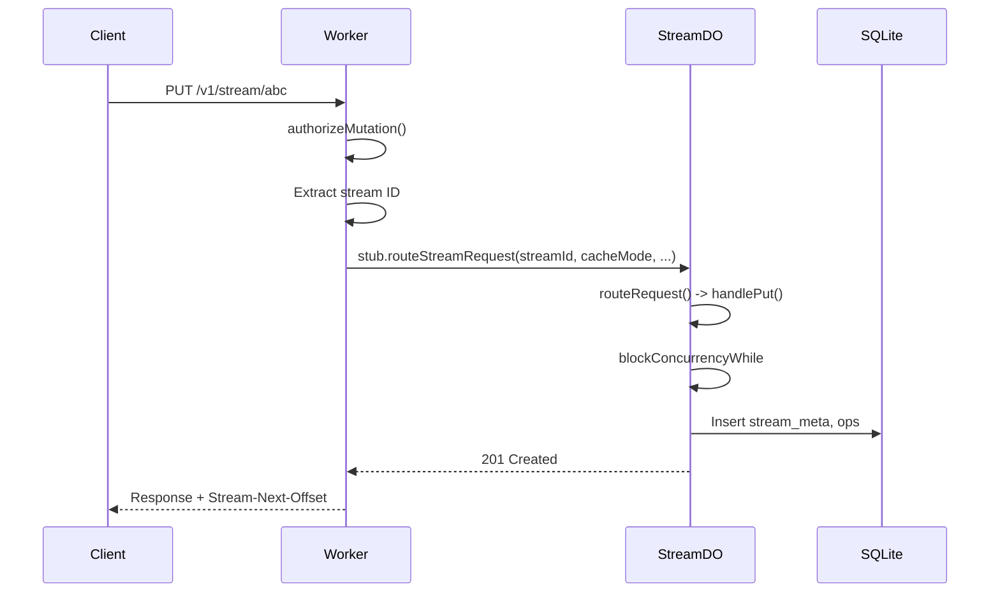
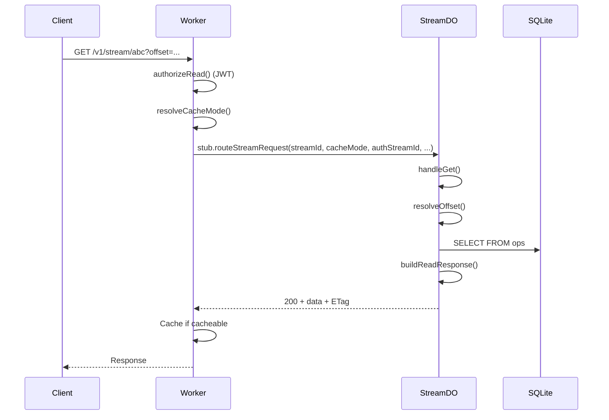
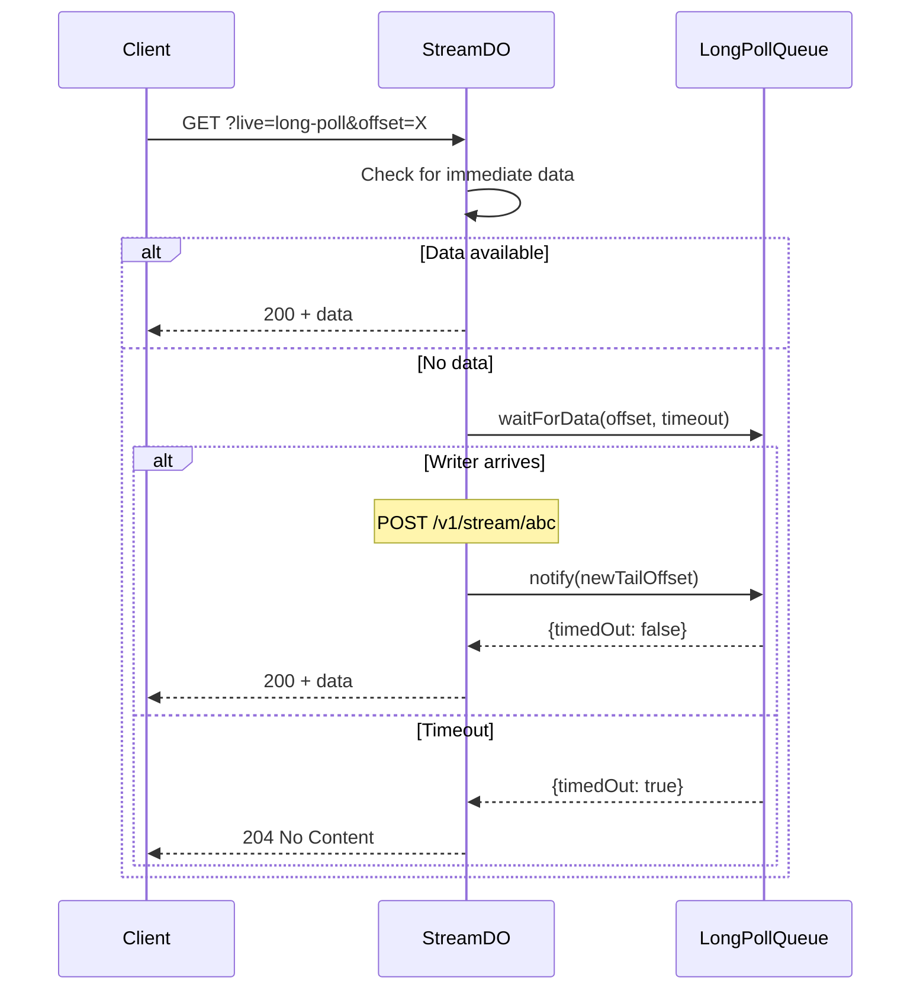
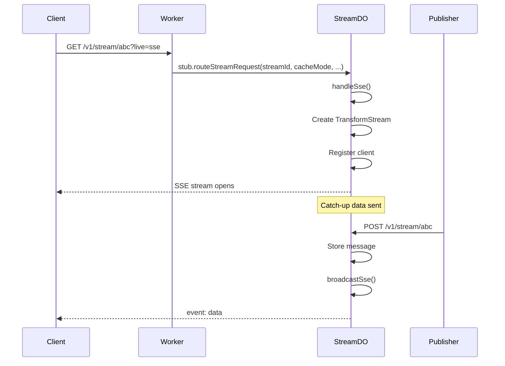
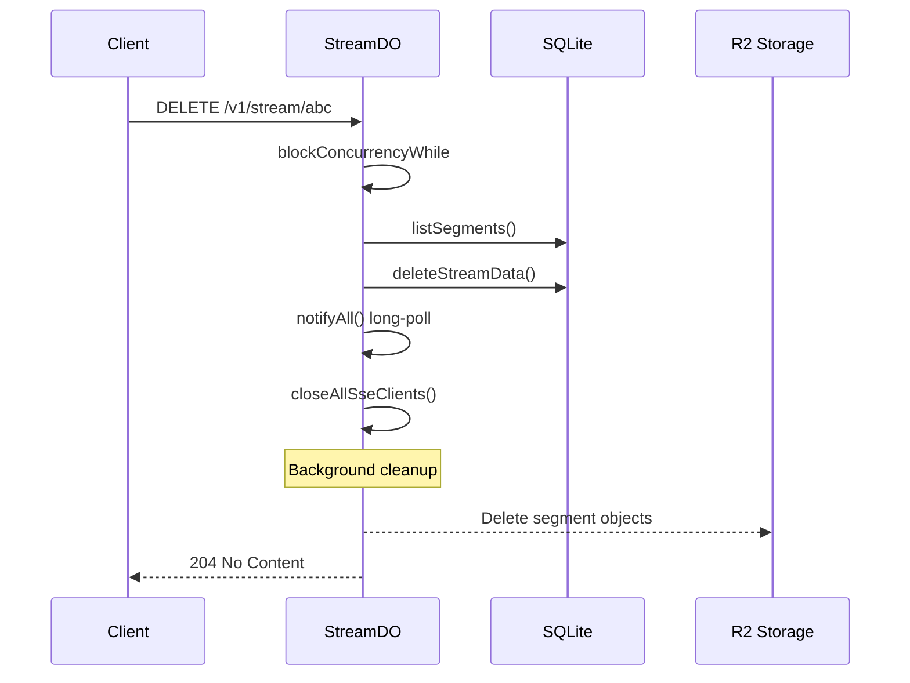

# Durable Streams Core

Data Flow Walkthrough

  
    Five stories showing how data moves through the system
  

---
layout: section
---

# Story 1: A Message is Written

Follow a PUT request from arrival to storage

---

# 1. The Request Arrives

A client sends: `PUT /v1/stream/user-123`

<<< @/../core/src/http/index.ts#docs-request-arrives

The `createStreamWorker` factory builds a Worker with middleware (path parsing, CORS, JWT auth) that forwards to the DO via typed RPC.

---

# 2. Authorizing the Request

<<< @/../core/src/http/middleware/authorization.ts#docs-authorize-request

Stream auth is a Hono middleware mounted on `/v1/stream/*`. It checks scope (`write`/`manage` for mutations) and the public flag (for reads). JWT tokens are validated by the upstream JWT middleware; stream auth uses the claims from context.

---

# 3. Extracting the Stream ID

<<< @/../core/src/http/middleware/authorization.ts#docs-extract-stream-id

The stream ID is extracted from the URL path and validated.

---

# 4. Routing to the Durable Object

<<< @/../core/src/http/index.ts#docs-route-to-do

Every stream maps to exactly one Durable Object instance. The Worker calls `stub.routeStreamRequest()` via typed RPC — stream ID, cache mode, auth stream ID, and timing flag are passed as typed parameters alongside the original `Request`.

---

# 5. Inside the Durable Object

<<< @/../core/src/http/durable-object.ts#docs-do-rpc

`StreamDO` extends <code>DurableObject&lt;StreamEnv&gt;</code> and exposes `routeStreamRequest()` as an RPC method. It receives typed parameters directly from the Worker — no header extraction needed.

---

# 6. Building the Context

<<< @/../core/src/http/durable-object.ts#docs-build-context

The context includes storage, SSE/long-poll state, and functions for offset encoding and segment rotation.

---

# 7. Handling PUT (Stream Creation)

<<< @/../core/src/http/v1/streams/create/index.ts#docs-handle-put

PUT creates or updates a stream. Everything runs inside `blockConcurrencyWhile` for consistency.

---

# 9. Handling POST (Append Messages)

<<< @/../core/src/http/v1/streams/append/index.ts#docs-handle-post

POST appends messages. Producer headers enable duplicate detection via epoch/seq tracking.

---

# 10. Side Effects After Mutation

<<< @/../core/src/http/v1/streams/append/index.ts#docs-side-effects

After storing, the handler notifies long-poll waiters, broadcasts to SSE clients, and triggers segment rotation.

---

# The Write Path

---
layout: section
---

# Story 2: A Client Reads Messages

Follow a GET request for historical data

---

# 1. Read Authorization (JWT)

For reads, JWT auth middleware validates the token and stores claims in context. Public streams skip auth entirely; non-public streams require a valid JWT. The edge handler checks the `public` flag via KV metadata before enforcing auth.

---

# 2. Edge Cache

The edge handler checks cache status before hitting the DO. Non-public streams include a reader key in the cache URL so unauthorized clients can't match cached entries.

---

# 3. Handling GET

<<< @/../core/src/http/v1/streams/read/handler.ts#docs-handle-get

GET first checks for live modes (SSE, long-poll), then falls back to direct read.

---

# 4. Resolving the Offset

<<< @/../core/src/http/v1/streams/read/handler.ts#docs-resolve-offset

The offset can be `-1` (start), `now` (tail), or an encoded cursor. Data is read up to `MAX_CHUNK_BYTES`.

---

# 5. Building the Response

<<< @/../core/src/http/v1/streams/read/handler.ts#docs-build-response

Response includes ETag, cache headers, and the next offset for pagination.

---

# The Read Path

---
layout: section
---

# Story 3: Long-Polling for Updates

Follow a long-poll request from wait to data delivery

---

# 1. Long-Poll Handler Setup

<<< @/../core/src/http/v1/streams/realtime/handlers.ts#docs-long-poll-setup

The handler validates the offset, reads cache mode from context, and checks for closed streams at tail.

---

# 2. Checking for Immediate Data

<<< @/../core/src/http/v1/streams/realtime/handlers.ts#docs-long-poll-immediate

If data is immediately available, return it without waiting.

---

# 3. The Waiting Game

<<< @/../core/src/http/v1/streams/realtime/handlers.ts#docs-long-poll-wait

If no data available, wait up to `LONG_POLL_TIMEOUT_MS` (default 30s). On timeout, return 204.

---

# 4. The Long-Poll Queue

<<< @/../core/src/http/v1/streams/realtime/handlers.ts#docs-long-poll-queue

Waiters register with their current offset. When new data arrives, `notify()` wakes waiters.

---

# The Long-Poll Path

---
layout: section
---

# Story 4: A Client Listens via SSE

Follow an SSE connection from open to message delivery

---

# 1. SSE Mode Detection

<<< @/../core/src/http/v1/streams/read/handler.ts#docs-sse-mode-detection

The `live` query parameter determines streaming mode: `sse` or `long-poll`.

---

# 2. Setting Up SSE

<<< @/../core/src/http/v1/streams/realtime/handlers.ts#docs-sse-setup

A TransformStream is created, and the client is registered with a unique ID.

---

# 3. SSE Client Lifecycle

<<< @/../core/src/http/v1/streams/realtime/handlers.ts#docs-sse-lifecycle

Each client gets a close timer (55 seconds) and the response stream is returned.

---

# 4. Broadcasting to SSE Clients

<<< @/../core/src/http/v1/streams/realtime/handlers.ts#docs-broadcast-sse

When messages are written, `broadcastSse` pushes to all connected clients.

---

# 5. SSE Event Format

<<< @/../core/src/http/v1/streams/realtime/handlers.ts#docs-sse-data-event

Data events are encoded as standard SSE format. Binary content is base64-encoded.

---

# 6. SSE Control Events

<<< @/../core/src/http/v1/streams/realtime/handlers.ts#docs-sse-control-event

Control events include the next offset, up-to-date status, and cursor for resume.

---

# The Real-Time Path

---
layout: section
---

# Story 5: Deleting a Stream

Follow a DELETE request through cascade cleanup

---

# 1. The Delete Handler

<<< @/../core/src/http/v1/streams/delete/index.ts#docs-handle-delete

DELETE cascades through all storage layers: SQLite ops → R2 segments.

---

# 2. Notify Connected Clients

When a stream is deleted, both long-poll waiters and SSE clients are notified immediately:

- `longPoll.notifyAll()` wakes all waiting clients
- `closeAllSseClients()` cleanly closes SSE connections

---

# The Delete Path

---
layout: section
---

# Supporting Topics

---

# Offset Encoding

<<< @/../core/src/http/v1/streams/shared/offsets.ts#docs-encode

Offsets encode both the byte offset and read sequence (for segment lookups).

---

# Offset Decoding

<<< @/../core/src/http/v1/streams/shared/offsets.ts#docs-decode

---

# Segment Rotation

<<< @/../core/src/http/v1/streams/shared/rotate.ts#docs-rotate-check

Segments rotate when they exceed size or message count thresholds.

---

# Segment Storage

<<< @/../core/src/http/v1/streams/shared/rotate.ts#docs-rotate-store

Messages are serialized to R2, then ops are deleted from SQLite.

---

# Producer Deduplication (Types)

<<< @/../core/src/http/v1/streams/shared/producer.ts#docs-producer-types

Producers provide idempotency through epoch/sequence tracking.

---

# Producer Deduplication (State Machine)

<<< @/../core/src/http/v1/streams/shared/producer.ts#docs-producer-evaluate

The state machine handles: new producer, epoch bump, duplicate, sequence gap.

---

# R2 Cold Storage - The ReadPath Class

<<< @/../core/src/http/v1/streams/read/path.ts#docs-read-path-class

ReadPath provides a unified read interface with coalescing and caching.

---

# R2 Cold Storage - Segment Lookup

<<< @/../core/src/http/v1/streams/read/path.ts#docs-resolve-storage-tier

When offset is below `segment_start`, read from R2 segments instead of SQLite.

---

# R2 Cold Storage - Decoding Segments

<<< @/../core/src/http/v1/streams/read/path.ts#docs-read-r2-segment

Segment data is fetched from R2, then decoded and filtered by offset.

---

# HEAD Endpoint (Metadata Queries)

The HEAD method returns stream metadata without body content:

- `Stream-Next-Offset`: Current tail offset (encoded)
- `Stream-Closed`: Whether the stream is closed
- `Content-Type`: The stream's content type
- `ETag`: Current state hash for caching

Useful for checking stream existence or polling for state changes.

---

# Error Responses

<<< @/../core/src/http/shared/errors.ts#docs-error-response

All errors use consistent headers and format.

---
layout: center
class: text-center
---

# Questions?

[Source Code](../core/src)

  
    Navigate: Arrow keys | Overview: O | Exit: Esc
  

