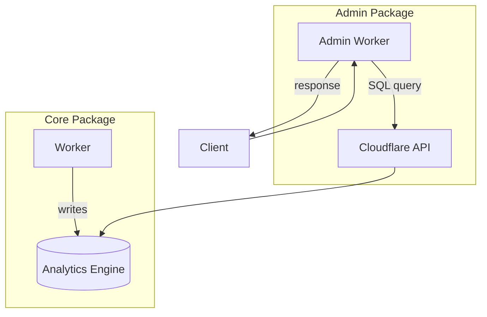

# Durable Streams Admin

Data Flow Walkthrough

  
    Two stories: Querying streams and fetching metrics
  

---
layout: section
---

# Story 1: Querying the Stream Registry

Follow a list/get request through the admin API

---

# 1. The Worker Entry Point

<<< @/../src/worker.ts#L1-L25 ts

The Hono app defines the environment with D1, Core URL, and optional Analytics Engine credentials.

---

# 2. Auth Middleware

<<< @/../src/worker.ts#L27-L45 ts

Optional bearer auth is checked if `AUTH_TOKEN` is configured.

---

# 3. Route Mounting

<<< @/../src/worker.ts#L47-L55 ts

Routes are modular: streams, metrics, and health each have their own route file.

---

# 4. List Streams Endpoint

<<< @/../src/routes/streams.ts#L21-L38 ts

Query params are validated with Zod. Pagination uses limit/offset.

---

# 5. The D1 Query

<<< @/../src/services/d1.ts#L27-L50 ts

D1 stores the stream registry. `WHERE deleted_at IS NULL` filters soft-deleted streams.

---

# 6. Single Stream with Live Data

<<< @/../src/routes/streams.ts#L46-L74 ts

Single stream queries merge registry data with live config from Core.

---

# 7. Fetching from Core

<<< @/../src/core-client.ts#L16-L39 ts

`fetchFromCore` prefers service binding over HTTP for better performance.

---

# 8. Stats Endpoint

<<< @/../src/routes/streams.ts#L40-L44 ts

GET `/streams/stats` returns aggregate statistics.

---

# 9. Stats Query

<<< @/../src/services/d1.ts#L74-L107 ts

Counts active/deleted streams, total segments, and storage size.

---

# 10. Segments Endpoint

<<< @/../src/routes/streams.ts#L76-L81 ts

GET `/streams/:streamId/segments` lists all R2 segments for a stream.

---

# 11. Segments Query

<<< @/../src/services/d1.ts#L63-L72 ts

Returns segment metadata: offsets, R2 keys, sizes, and message counts.

---

# The Registry Flow

---
layout: section
---

# Story 2: Fetching Metrics

Follow a metrics request through Analytics Engine

---

# 1. Metrics Route Setup

<<< @/../src/routes/metrics.ts#L19-L34 ts

Time ranges and intervals are validated with Zod schemas.

---

# 2. The Summary Endpoint

<<< @/../src/routes/metrics.ts#L35-L45 ts

Summary returns per-stream metrics aggregated over the time range.

---

# 3. The Totals Endpoint

<<< @/../src/routes/metrics.ts#L47-L57 ts

GET `/metrics/totals` returns aggregate totals across all streams.

---

# 4. The Top Streams Endpoint

<<< @/../src/routes/metrics.ts#L76-L86 ts

GET `/metrics/top-streams` returns the N most active streams by message count.

---

# 5. Building the Summary Query

<<< @/../src/services/analytics.ts#L81-L99 ts

SQL query aggregates metrics from Analytics Engine by stream_id.

---

# 6. Building the Totals Query

<<< @/../src/services/analytics.ts#L101-L116 ts

Totals aggregate all streams: total messages, bytes, unique streams, event count.

---

# 7. Building the Top Streams Query

<<< @/../src/services/analytics.ts#L142-L164 ts

Orders by messages written descending, with configurable limit.

---

# 8. Executing Against Analytics Engine

<<< @/../src/services/analytics.ts#L36-L74 ts

The Analytics Engine API accepts SQL queries and returns JSON results.

---

# 9. Timeline Queries

<<< @/../src/services/analytics.ts#L166-L185 ts

Timeline data buckets metrics by time interval for charts.

---

# Metrics Data Flow

Core writes metrics. Admin reads them via the Cloudflare Analytics API.

---

# Available Metrics Endpoints

| Endpoint | Purpose | Params |
|----------|---------|--------|
| `GET /api/metrics/summary` | Per-stream summary | `range` |
| `GET /api/metrics/totals` | Aggregate across all | `range` |
| `GET /api/metrics/streams/:id` | Single stream detail | `range` |
| `GET /api/metrics/top-streams` | Top N by messages | `range`, `limit` |
| `GET /api/metrics/timeline` | Time-series buckets | `range`, `interval` |

**Ranges:** `1h`, `24h`, `7d`
**Intervals:** `5m`, `1h`, `1d`

---
layout: section
---

# Supporting Topics

Health monitoring and stream stats

---

# Health Checks

<<< @/../src/routes/health.ts#L21-L70 ts

Health checks measure latency to D1 and Core, detecting failures for alerting.

---

# Health Response

<<< @/../src/routes/health.ts#L71-L81 ts

Overall status is `ok`, `degraded`, or `down` based on dependency health.

---

# Stream Stats

<<< @/../src/services/d1.ts#L74-L107 ts

Aggregate stats: total streams, active vs deleted, total segments and size.

---
layout: center
class: text-center
---

# Questions?

[Source Code](../src) | [Core](../../durable-stream-core/docs/walkthrough.md) | [Subscriptions](../../durable-stream-subscriptions/docs/walkthrough.md)

  
    Navigate: Arrow keys | Overview: O | Exit: Esc
  

