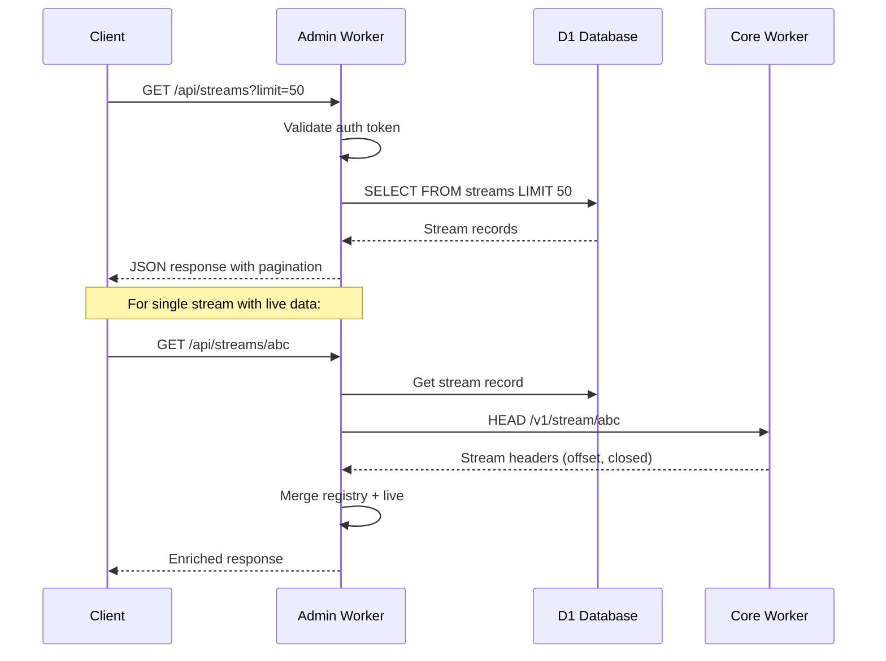
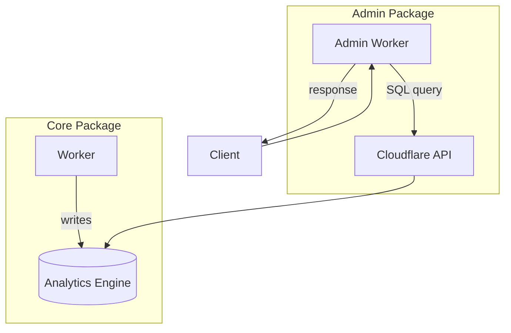

# Durable Streams Admin

Data Flow Walkthrough

<div class="pt-12">
  <span class="px-2 py-1 rounded bg-gray-100">
    Two stories: Querying streams and fetching metrics
  </span>
</div>

---
layout: section
---

# Story 1: Querying the Stream Registry

Follow a list/get request through the admin API

---

# 1. The Request

A client sends: `GET /api/streams?limit=50`

```ts {all|4-9|11-15}
// src/worker.ts - Admin API entry point
const app = new Hono<{ Bindings: Env }>();

// CORS for browser access
app.use("/*", cors({
  origin: "*",
  allowMethods: ["GET", "POST", "OPTIONS"],
}));

// Optional Bearer token auth
app.use("/*", async (c, next) => {
  if (c.env.AUTH_TOKEN) {
    const auth = c.req.header("Authorization");
    if (auth !== `Bearer ${c.env.AUTH_TOKEN}`) {
      return c.json({ error: "Unauthorized" }, 401);
    }
  }
  await next();
});
```

The admin API uses Hono with optional auth. CORS allows browser-based admin UIs.

---

# 2. Querying D1

```ts {all|4-11|13-20}
// src/routes/streams.ts - List streams with pagination
app.get("/api/streams", async (c) => {
  const limit = Math.min(parseInt(c.req.query("limit") ?? "100"), 1000);
  const offset = parseInt(c.req.query("offset") ?? "0");
  const includeDeleted = c.req.query("includeDeleted") === "true";

  const result = await listStreams(c.env.ADMIN_DB, {
    limit,
    offset,
    includeDeleted,
  });

  return c.json({
    streams: result.streams,
    total: result.total,
    limit,
    offset,
    hasMore: offset + result.streams.length < result.total,
  });
});
```

D1 stores the stream registry. Pagination prevents overwhelming responses.

---

# 3. The D1 Query

```ts {all|3-10|12-18}
// src/services/d1.ts - List streams from registry
export async function listStreams(
  db: D1Database,
  options: { limit: number; offset: number; includeDeleted: boolean }
): Promise<{ streams: StreamRecord[]; total: number }> {
  const whereClause = options.includeDeleted ? "" : "WHERE deleted_at IS NULL";

  const countResult = await db.prepare(`
    SELECT COUNT(*) as count FROM streams ${whereClause}
  `).first<{ count: number }>();

  const streams = await db.prepare(`
    SELECT stream_id, content_type, created_at, deleted_at
    FROM streams
    ${whereClause}
    ORDER BY created_at DESC
    LIMIT ? OFFSET ?
  `).bind(options.limit, options.offset).all();

  return { streams: streams.results as StreamRecord[], total: countResult?.count ?? 0 };
}
```

Soft deletes (deleted_at) allow viewing historical streams.

---

# 4. Enriching with Live Data

```ts {all|4-10|12-18}
// src/routes/streams.ts - Single stream with live config
app.get("/api/streams/:streamId", async (c) => {
  const streamId = c.req.param("streamId");

  // Get from D1 registry
  const stream = await getStream(c.env.ADMIN_DB, streamId);
  if (!stream) {
    return c.json({ error: "Stream not found" }, 404);
  }

  // Optionally fetch live config from Core
  let liveConfig = null;
  try {
    const response = await fetchFromCore(c.env, `/v1/stream/${streamId}`, {
      method: "HEAD",
    });
    liveConfig = {
      tailOffset: response.headers.get("Stream-Next-Offset"),
      closed: response.headers.get("Stream-Closed") === "true",
    };
  } catch (e) {
    // Core might be unavailable - return registry data only
  }

  return c.json({ ...stream, liveConfig });
});
```

Single stream queries merge registry data with live state from Core.

---

# The Registry Flow



---
layout: section
---

# Story 2: Fetching Metrics

Follow a metrics request through Analytics Engine

---

# 1. The Request

A client sends: `GET /api/metrics/summary?range=24h`

```ts {all|4-9|11-15}
// src/routes/metrics.ts - Metrics summary endpoint
app.get("/api/metrics/summary", async (c) => {
  const range = c.req.query("range") ?? "24h";

  // Validate range
  if (!["1h", "24h", "7d"].includes(range)) {
    return c.json({ error: "Invalid range. Use: 1h, 24h, 7d" }, 400);
  }

  // Check if Analytics Engine is configured
  if (!c.env.CF_ACCOUNT_ID || !c.env.METRICS_API_TOKEN) {
    return c.json({ error: "Metrics not configured" }, 503);
  }

  const metrics = await getStreamMetricsSummary(c.env, range);
  return c.json(metrics);
});
```

Metrics are optional - requires Cloudflare account ID and API token.

---

# 2. Querying Analytics Engine

```ts {all|4-12|14-22}
// src/services/analytics.ts - Build and execute Analytics SQL
export async function getStreamMetricsSummary(
  env: AnalyticsEnv,
  timeRange: string
): Promise<StreamMetrics[]> {
  const interval = timeRangeToInterval(timeRange); // "1h" -> "1 HOUR"

  const query = `
    SELECT
      blob1 as stream_id,
      SUM(double1) as messages_written,
      SUM(double2) as bytes_written,
      COUNT(*) as events
    FROM durable_streams_metrics
    WHERE timestamp > NOW() - INTERVAL '${interval}'
    GROUP BY blob1
    ORDER BY messages_written DESC
  `;

  return executeQuery(env, query);
}
```

Analytics Engine stores time-series metrics. SQL queries aggregate them.

---

# 3. The Analytics API

```ts {all|4-12|14-22}
// src/services/analytics.ts - Execute against Cloudflare API
async function executeQuery(env: AnalyticsEnv, query: string): Promise<unknown> {
  const url = `https://api.cloudflare.com/client/v4/accounts/${env.CF_ACCOUNT_ID}/analytics_engine/sql`;

  const response = await fetch(url, {
    method: "POST",
    headers: {
      "Authorization": `Bearer ${env.METRICS_API_TOKEN}`,
      "Content-Type": "text/plain",
    },
    body: query,
  });

  const result = await response.json();
  if (!result.success) {
    throw new Error(result.errors?.join(", ") ?? "Query failed");
  }

  return result.data;
}
```

The Analytics Engine API accepts SQL queries and returns JSON results.

---

# 4. The Response

```ts {all|4-12|14-18}
// Response structure for summary endpoint
{
  "streams": [
    {
      "streamId": "events",
      "messagesWritten": 15234,
      "bytesWritten": 4521890,
      "readsCount": 8921
    },
    {
      "streamId": "notifications",
      "messagesWritten": 8912,
      "bytesWritten": 1234567,
      "readsCount": 12045
    }
  ],
  "timeRange": "24h",
  "queriedAt": 1704067200000
}
```

Metrics are aggregated per stream, sorted by activity.

---

# Metrics Data Flow



Core writes metrics. Admin reads them via the Cloudflare Analytics API.

---

# Available Metrics Endpoints

| Endpoint | Purpose | Params |
|----------|---------|--------|
| `GET /api/metrics/summary` | Per-stream summary | `range` |
| `GET /api/metrics/totals` | Aggregate across all | `range` |
| `GET /api/metrics/streams/:id` | Single stream detail | `range` |
| `GET /api/metrics/top-streams` | Top N by messages | `range`, `limit` |
| `GET /api/metrics/timeline` | Time-series buckets | `range`, `interval` |

**Ranges:** `1h`, `24h`, `7d`
**Intervals:** `5m`, `1h`, `1d`

---
layout: section
---

# Supporting Topics

Health monitoring and timeline queries

---

# Health Checks

Monitor dependencies for operations

```ts {all|4-12|14-22}
// src/routes/health.ts - System health endpoint
app.get("/health", async (c) => {
  const checks: Record<string, HealthCheck> = {};

  // Check D1 connectivity
  const d1Start = Date.now();
  try {
    await c.env.ADMIN_DB.prepare("SELECT 1").first();
    checks.d1 = { status: "ok", latencyMs: Date.now() - d1Start };
  } catch (e) {
    checks.d1 = { status: "down", latencyMs: Date.now() - d1Start, error: String(e) };
  }

  // Check Core connectivity
  const coreStart = Date.now();
  try {
    const response = await fetchFromCore(c.env, "/health");
    checks.core = {
      status: response.ok ? "ok" : "down",
      latencyMs: Date.now() - coreStart,
    };
  } catch (e) {
    checks.core = { status: "down", latencyMs: Date.now() - coreStart, error: String(e) };
  }

  // Overall status
  const allOk = Object.values(checks).every(c => c.status === "ok");
  return c.json({ status: allOk ? "ok" : "degraded", checks }, allOk ? 200 : 503);
});
```

Health checks measure latency and detect failures for alerting.

---

# Timeline Queries

Time-series bucketing for graphs

```ts {all|4-12|14-20}
// src/services/analytics.ts - Time-series with buckets
export async function getTimeline(
  env: AnalyticsEnv,
  timeRange: string,
  interval: string // "5m", "1h", "1d"
): Promise<TimelinePoint[]> {
  const query = `
    SELECT
      toStartOfInterval(timestamp, INTERVAL '${interval}') as bucket,
      COUNT(*) as events,
      SUM(double1) as messages,
      SUM(double2) as bytes
    FROM durable_streams_metrics
    WHERE timestamp > NOW() - INTERVAL '${timeRangeToInterval(timeRange)}'
    GROUP BY bucket
    ORDER BY bucket ASC
  `;

  return executeQuery(env, query);
}

// Returns: [{ bucket: "2024-01-01T00:00:00Z", events: 1234, messages: 5678, bytes: 901234 }, ...]
```

Timeline data powers charts in admin dashboards.

---
layout: center
class: text-center
---

# Questions?

[Admin Source](../src) | [Core Package](../../durable-stream-core/docs/walkthrough.md)

<div class="pt-12">
  <span class="px-2 py-1 rounded bg-gray-100">
    Navigate: Arrow keys | Overview: O | Exit: Esc
  </span>
</div>
