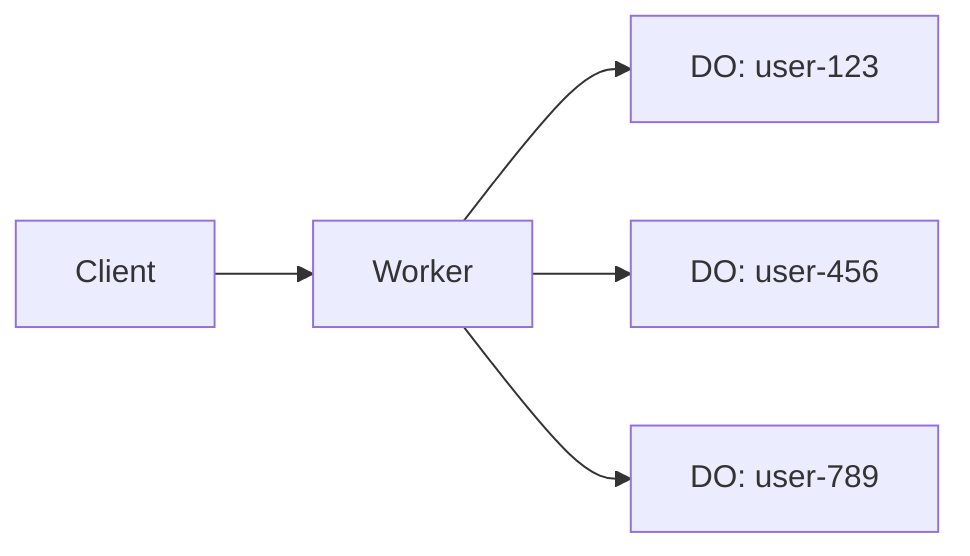
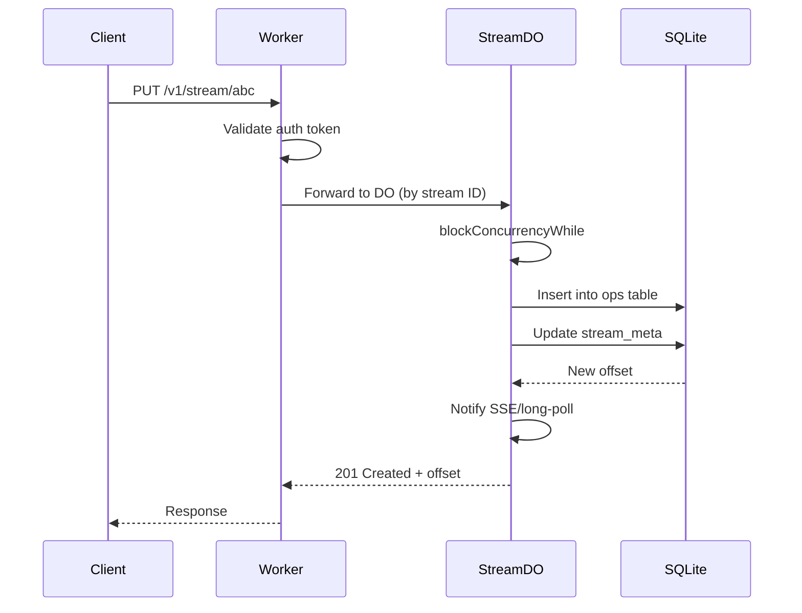
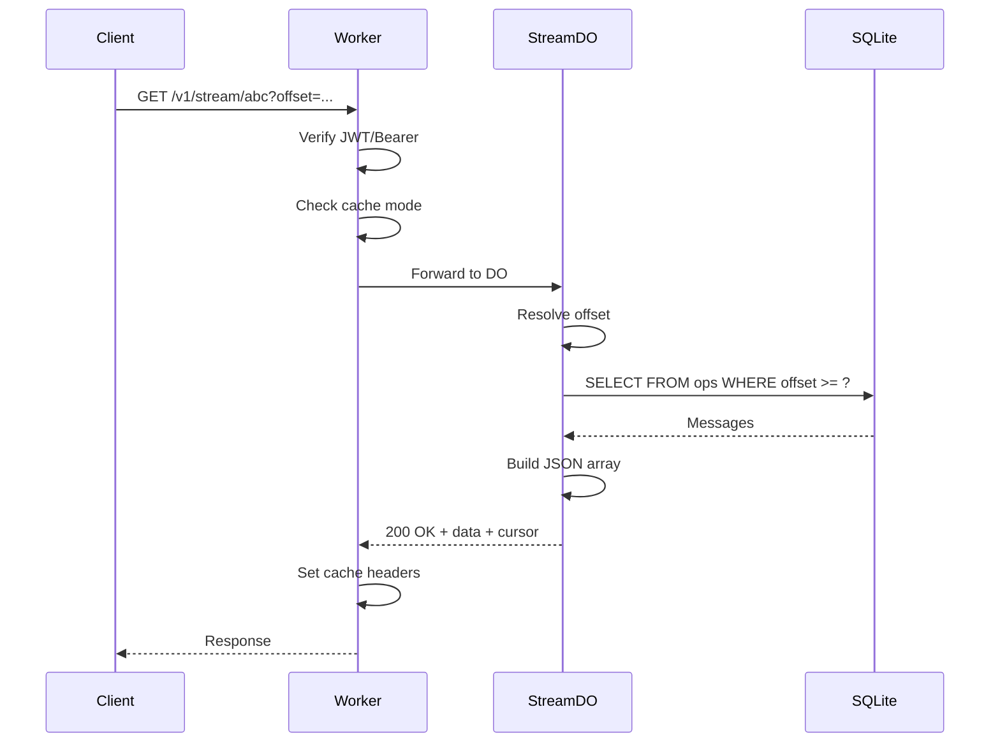
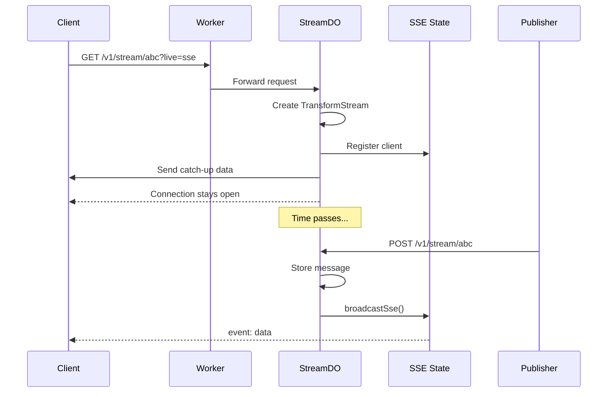

# Durable Streams Core

Data Flow Walkthrough

<div class="pt-12">
  <span class="px-2 py-1 rounded bg-gray-100">
    Three stories showing how data moves through the system
  </span>
</div>

---
layout: section
---

# Story 1: A Message is Written

Follow a PUT request from arrival to storage

---

# 1. The Request Arrives

A client sends: `PUT /v1/stream/user-123`

```ts {all|6-10|12-15}
// src/worker.ts - The edge worker receives the request
export default {
  async fetch(request: Request, env: Env): Promise<Response> {
    const url = new URL(request.url);

    // Extract stream ID from path: /v1/stream/<streamId>
    const match = url.pathname.match(/^\/v1\/stream\/([^/]+)/);
    if (!match) {
      return new Response("Not Found", { status: 404 });
    }
    const streamId = match[1];

    // Validate auth token (Bearer token for writes)
    const authResult = await authorizeRequest(request, env);
    if (!authResult.authorized) {
      return authResult.response!;
    }
    // ...
  }
}
```

The worker extracts `user-123` as the stream ID and validates the Bearer token.

---

# 2. Routing to the Durable Object

```ts {all|3-6|8-10}
// src/worker.ts - Route to the single DO instance for this stream
const doId = env.STREAM_DO.idFromName(streamId);
const stub = env.STREAM_DO.get(doId);

// Forward the entire request to the Durable Object
// Each stream ID maps to exactly one DO instance
const doResponse = await stub.fetch(request);
```

**Key insight:** Every stream maps to exactly one Durable Object instance. The stream ID becomes a deterministic DO name, guaranteeing all requests for `user-123` go to the same DO.



---

# 3. Inside the Durable Object

```ts {all|5-8|10-13}
// src/stream_do.ts - StreamDO receives the forwarded request
export class StreamDO {
  async fetch(request: Request): Promise<Response> {
    const url = new URL(request.url);
    const streamId = url.pathname.split("/")[3]; // /v1/stream/<id>

    // Build context with storage, timing, and live-update queues
    const ctx: StreamContext = {
      state: this.state,
      storage: this.storage,
      longPoll: this.longPoll,
      sseState: this.sseState,
      // ... offset resolution, segment rotation functions
    };

    // Route to the appropriate handler
    return routeRequest(ctx, streamId, request);
  }
}
```

The DO creates a context object with everything handlers need: storage access, SSE clients, long-poll waiters.

---

# 4. Processing the Mutation

```ts {all|3-6|8-12}
// src/http/handlers/mutation.ts - handlePut for stream creation
export async function handlePut(
  ctx: StreamContext,
  streamId: string,
  request: Request
): Promise<Response> {
  // Parse and validate the input
  const input = await extractPutInput(request, streamId);
  const validation = await validatePutInput(ctx, input);
  if (!validation.valid) {
    return validation.response!;
  }

  // Execute the mutation inside a concurrency block
  return await ctx.state.blockConcurrencyWhile(async () => {
    return executePut(ctx, input);
  });
}
```

**`blockConcurrencyWhile`** ensures only one mutation runs at a time - critical for consistent sequencing.

---

# 5. Storing the Message

```ts {all|3-8|10-14}
// src/engine/stream.ts - buildAppendBatch creates insert statements
const statements = buildAppendBatch(
  streamId,
  input.body,
  input.contentType,
  producer,
  meta.tail_offset
);

// src/storage/do_sqlite.ts - Execute against SQLite
for (const stmt of statements) {
  this.state.storage.sql.exec(stmt.sql, ...stmt.params);
}
// Updates: ops table (messages), stream_meta (tail_offset), producers
```

Messages are stored in the `ops` table. The `stream_meta` table tracks the current tail offset.

---

# 6. The Response

```ts {all|3-7|9-13}
// After successful write, notify waiting readers
ctx.longPoll.notifyAll();  // Wake long-poll clients
broadcastSse(ctx.sseState, payload, meta);  // Push to SSE clients

// Check if segment rotation needed
if (shouldRotate(meta)) {
  await ctx.rotateSegment(streamId);
}

// Return the new offset to the client
return new Response(null, {
  status: 201,
  headers: {
    "Stream-Next-Offset": encodeOffset(newOffset, meta.read_seq),
  }
});
```

The response includes the new offset so the client knows where their message landed.

---

# The Write Path



---
layout: section
---

# Story 2: A Client Reads Messages

Follow a GET request for historical data

---

# 1. The Read Request

A client sends: `GET /v1/stream/abc?offset=0000000000000000_0000000000000000`

```ts {all|4-8|10-14}
// src/worker.ts - Read requests can use JWT auth
const url = new URL(request.url);
const offsetParam = url.searchParams.get("offset") || "-1";

// For reads, we support session-based JWT auth (not just Bearer)
if (request.method === "GET") {
  const readAuth = await authorizeRead(request, env);
  if (!readAuth.authorized) {
    return readAuth.response!;
  }
}

// Resolve cache mode: shared (CDN cacheable) or private
const cacheMode = resolveCacheMode({
  envMode: env.CACHE_MODE,
  authMode: readAuth.mode
});
```

Reads can be authenticated via JWT (for sessions) or Bearer tokens.

---

# 2. Cache Considerations

```ts {all|3-9|11-15}
// src/http/cache_mode.ts - Determine caching behavior
export function resolveCacheMode(options: {
  envMode?: string;
  authMode?: "bearer" | "jwt" | "none";
}): "shared" | "private" {
  // Private if using JWT (session-specific data)
  if (options.authMode === "jwt") return "private";
  // Shared if no auth or Bearer (stream is same for all readers)
  return options.envMode ?? "shared";
}

// Headers set based on cache mode
if (cacheMode === "shared") {
  headers.set("Cache-Control", "public, max-age=2");
} else {
  headers.set("Cache-Control", "private, no-store");
}
```

**Shared cache** = CDN can cache the response for all readers.
**Private cache** = Response is specific to this session.

---

# 3. Finding the Data

```ts {all|3-8|10-15}
// src/http/handlers/catchup.ts - handleGet
export async function handleGet(
  ctx: StreamContext,
  streamId: string,
  request: Request
): Promise<Response> {
  const meta = await ctx.getStream(streamId);
  if (!meta) return errorResponse(404, "Stream not found");

  // Resolve the offset (handles "now", "-1", or encoded offset)
  const resolved = await ctx.resolveOffset(streamId, meta, offsetParam);

  // Read messages from the resolved offset
  const result = await ctx.readFromOffset(
    streamId, meta, resolved.offset, MAX_CHUNK_BYTES
  );
  // ...
}
```

The offset is resolved: `-1` means start, `now` means tail, otherwise decode the cursor.

---

# 4. Building the Response

```ts {all|3-8|10-14}
// src/engine/stream.ts - readFromOffset
export async function readFromOffset(
  storage: StreamStorage,
  streamId: string,
  offset: number,
  maxBytes: number
): Promise<ReadResult> {
  // Query ops from this offset forward
  const messages = await storage.selectOpsFrom(streamId, offset);

  // Build JSON array, respecting max chunk size
  let totalBytes = 0;
  const included: Message[] = [];
  for (const msg of messages) {
    if (totalBytes + msg.size_bytes > maxBytes) break;
    included.push(msg);
    totalBytes += msg.size_bytes;
  }

  return { messages: included, nextOffset, upToDate };
}
```

Messages are read up to `MAX_CHUNK_BYTES` (256KB). The response includes a cursor for pagination.

---

# 5. The Response

```ts {all|3-9|11-14}
// src/engine/stream.ts - buildReadResponse
return new Response(buildJsonArray(result.messages), {
  status: 200,
  headers: {
    "Content-Type": "application/json",
    "Stream-Next-Offset": encodeOffset(result.nextOffset, meta.read_seq),
    "Stream-Up-To-Date": result.upToDate ? "true" : "false",
    "ETag": buildEtag(streamId, offset, result.nextOffset, meta.closed),
    "Cache-Control": cacheMode === "shared" ? "public, max-age=2" : "private",
  }
});

// Client uses Stream-Next-Offset for next request
// Stream-Up-To-Date: true means no more messages (for now)
```

The cursor (`Stream-Next-Offset`) lets the client paginate through history.

---

# The Read Path



---
layout: section
---

# Story 3: A Client Listens in Real-Time

Follow an SSE connection from open to message delivery

---

# 1. Opening the Connection

A client sends: `GET /v1/stream/abc?live=sse`

```ts {all|4-9|11-14}
// src/http/handlers/catchup.ts - Detect live mode
const liveMode = url.searchParams.get("live");

if (liveMode === "sse") {
  return handleSse(ctx, streamId, meta, offsetParam, request);
}
if (liveMode === "long-poll") {
  return handleLongPoll(ctx, streamId, meta, offsetParam);
}
// Otherwise: direct read (catch-up)

// SSE streams keep the connection open
// Long-poll waits up to 4 seconds then returns
// Direct read returns immediately
```

The `live` parameter determines the streaming mode.

---

# 2. Setting Up SSE

```ts {all|3-9|11-16}
// src/http/handlers/realtime.ts - handleSse
export async function handleSse(
  ctx: StreamContext,
  streamId: string,
  meta: StreamMeta,
  offsetParam: string,
  request: Request
): Promise<Response> {
  // Create a TransformStream for SSE output
  const { readable, writable } = new TransformStream();
  const writer = writable.getWriter();

  // Register this client
  const clientId = ctx.sseState.nextId++;
  ctx.sseState.clients.set(clientId, {
    id: clientId,
    writer,
    offset: resolvedOffset,
    contentType: meta.content_type,
    useBase64: !isTextual(meta.content_type),
  });
  // ...
}
```

Each SSE client gets a unique ID and a writer for pushing events.

---

# 3. Waiting for Messages

```ts {all|3-8|10-14}
// Send initial catch-up data (if any)
const catchup = await readFromOffset(ctx.storage, streamId, offset);
if (catchup.messages.length > 0) {
  const event = buildSseDataEvent(catchup.messages, useBase64);
  await writer.write(encoder.encode(event));
}

// Send control frame with current state
const control = buildSseControlEvent({
  nextOffset: encodeOffset(catchup.nextOffset, meta.read_seq),
  upToDate: catchup.upToDate,
  streamClosed: meta.closed,
  cursor: generateResponseCursor(requestCursor),
});
await writer.write(encoder.encode(control));

// Now we wait... the connection stays open
// When new messages arrive, broadcastSse will push to us
```

The client first receives any missed messages (catch-up), then waits for live updates.

---

# 4. A Message Arrives

```ts {all|4-8|10-15}
// src/http/handlers/mutation.ts - After a successful POST
// Notify all waiting clients

// Wake long-poll waiters
ctx.longPoll.notifyAll();

// Push to all SSE clients
broadcastSse(ctx.sseState, newMessages, meta);

// src/http/handlers/realtime.ts - broadcastSse
export function broadcastSse(
  state: SseState,
  messages: Message[],
  meta: StreamMeta
): void {
  for (const client of state.clients.values()) {
    const event = buildSseDataEvent(messages, client.useBase64);
    client.writer.write(encoder.encode(event));
  }
}
```

Writers notify all SSE clients immediately after committing messages.

---

# 5. Sending to Client

```ts {all|3-8|10-14}
// src/live/sse.ts - SSE event format
export function buildSseDataEvent(
  messages: Message[],
  useBase64: boolean
): string {
  const payload = useBase64
    ? btoa(JSON.stringify(messages))
    : JSON.stringify(messages);
  return `event: data\ndata: ${payload}\n\n`;
}

// Control events include cursor for resume
export function buildSseControlEvent(ctrl: ControlFrame): string {
  return `event: control\ndata: ${JSON.stringify(ctrl)}\n\n`;
}

// If client disconnects and reconnects, they use the cursor
// to resume from where they left off
```

SSE uses standard `event:` and `data:` format. Binary content is base64-encoded.

---

# The Real-Time Path



---
layout: section
---

# Supporting Topics

Key concepts that span across stories

---

# Cursor Encoding

How offsets become opaque tokens

```ts {all|3-7|9-13}
// src/protocol/offsets.ts
export const ZERO_OFFSET = "0000000000000000_0000000000000000";

// Format: {16-digit-readSeq}_{16-digit-byteOffset}
export function encodeOffset(offset: number, readSeq: number): string {
  const seqStr = readSeq.toString().padStart(16, "0");
  const offsetStr = offset.toString().padStart(16, "0");
  return `${seqStr}_${offsetStr}`;
}

// Decoding extracts both parts
export function decodeOffsetParts(token: string): {
  readSeq: number;
  byteOffset: number;
} | null {
  const match = token.match(/^(\d{16})_(\d{16})$/);
  if (!match) return null;
  return { readSeq: parseInt(match[1]), byteOffset: parseInt(match[2]) };
}
```

The `readSeq` helps locate which segment contains the offset.

---

# Segment Rotation

When hot storage moves to cold

```ts {all|3-8|10-15}
// src/do/segment_rotation.ts - Rotation triggers
const SEGMENT_MAX_BYTES = 4 * 1024 * 1024;  // 4MB
const SEGMENT_MAX_MESSAGES = 1000;

function shouldRotate(meta: StreamMeta): boolean {
  return meta.segment_bytes >= SEGMENT_MAX_BYTES
      || meta.segment_messages >= SEGMENT_MAX_MESSAGES;
}

// Rotation process
async function rotateSegment(ctx, streamId): Promise<void> {
  // 1. Read all ops from current segment
  const ops = await storage.selectAllOps(streamId);
  // 2. Serialize to R2 as immutable segment
  await r2.put(segmentKey, serialize(ops));
  // 3. Delete ops from SQLite (they're in R2 now)
  await storage.deleteOpsThrough(streamId, lastOffset);
  // 4. Update stream_meta with new read_seq
}
```

Hot data (SQLite) rotates to cold storage (R2) for long-term retention.

---

# Error Handling

Consistent error responses across the API

```ts {all|3-8|10-14}
// src/protocol/errors.ts
export function errorResponse(status: number, message: string): Response {
  return new Response(JSON.stringify({ error: message }), {
    status,
    headers: {
      "Content-Type": "application/json",
      ...baseHeaders(),
    }
  });
}

// Common error cases
// 404 - Stream not found
// 409 - Conflict (stream closed, wrong epoch)
// 400 - Bad request (invalid offset, missing headers)
// 401 - Unauthorized
// 413 - Payload too large (> 8MB)
```

All errors return JSON with consistent structure for client parsing.

---
layout: center
class: text-center
---

# Questions?

[Core Package Source](../src) | [Protocol Spec](../../docs/protocol.md)

<div class="pt-12">
  <span class="px-2 py-1 rounded bg-gray-100">
    Navigate: Arrow keys | Overview: O | Exit: Esc
  </span>
</div>
