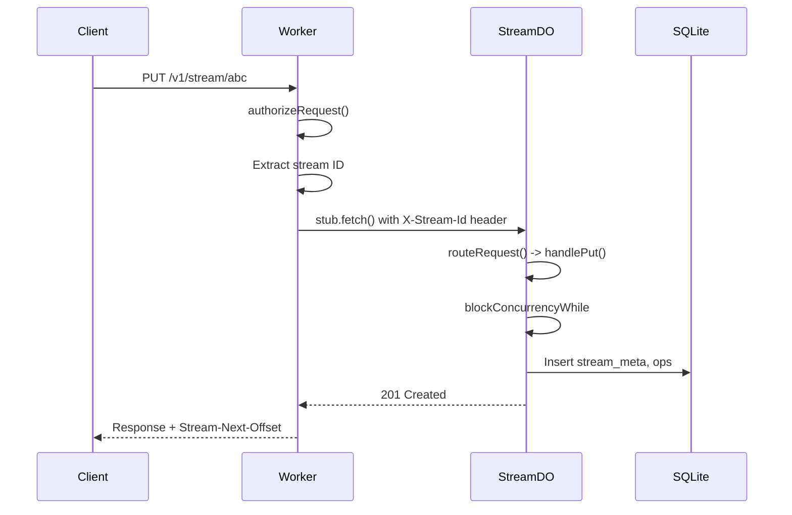
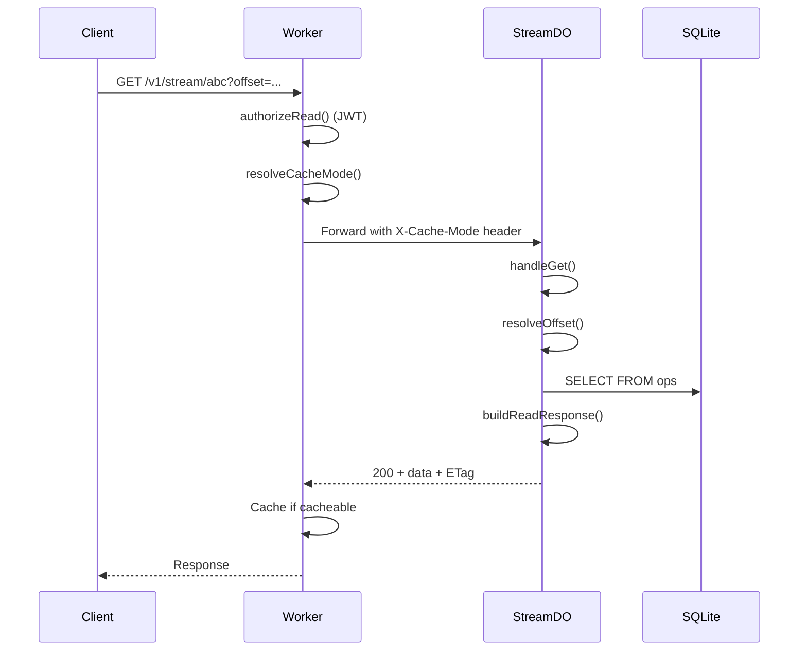
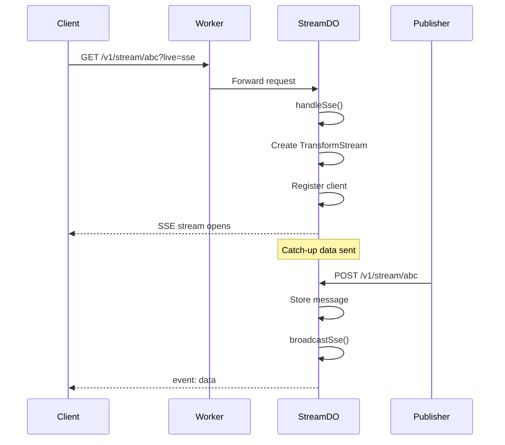

# Durable Streams Core

Data Flow Walkthrough

  
    Three stories showing how data moves through the system
  

---
layout: section
---

# Story 1: A Message is Written

Follow a PUT request from arrival to storage

---

# 1. The Request Arrives

A client sends: `PUT /v1/stream/user-123`

<<< @/../src/worker.ts#L180-L195 ts

The worker parses the URL, determines if it's a stream read, and validates authorization.

---

# 2. Authorizing the Request

<<< @/../src/worker.ts#L67-L76 ts

Bearer token auth is checked if `AUTH_TOKEN` is configured. Returns `{ ok: true }` on success.

---

# 3. Extracting the Stream ID

<<< @/../src/worker.ts#L233-L240 ts

The stream ID is extracted from the path and validated.

---

# 4. Routing to the Durable Object

<<< @/../src/worker.ts#L257-L272 ts

Every stream maps to exactly one Durable Object instance. The stream ID becomes a deterministic DO name via `idFromName()`.

---

# 5. Inside the Durable Object

<<< @/../src/stream_do.ts#L36-L55 ts

The DO extracts the stream ID from the `X-Stream-Id` header (set by the worker) and builds a context object.

---

# 6. Building the Context

<<< @/../src/stream_do.ts#L64-L85 ts

The context includes storage, SSE/long-poll state, and functions for offset encoding and segment rotation.

---

# 7. The Router

<<< @/../src/http/router.ts#L7-L30 ts

Requests are routed by HTTP method to the appropriate handler.

---

# 8. Handling PUT (Stream Creation)

<<< @/../src/http/handlers/mutation.ts#L22-L61 ts

PUT creates or updates a stream. Everything runs inside `blockConcurrencyWhile` for consistency.

---

# 9. Handling POST (Append Messages)

<<< @/../src/http/handlers/mutation.ts#L63-L102 ts

POST appends messages. Producer headers enable duplicate detection via epoch/seq tracking.

---

# 10. Side Effects After Mutation

<<< @/../src/http/handlers/mutation.ts#L113-L150 ts

After storing, the handler notifies long-poll waiters, broadcasts to SSE clients, and triggers segment rotation.

---

# The Write Path

---
layout: section
---

# Story 2: A Client Reads Messages

Follow a GET request for historical data

---

# 1. Read Authorization (JWT)

For reads, the worker can validate JWT tokens for session-based access:

<<< @/../src/worker.ts#L134-L149 ts

JWT claims include `session_id` and `exp` (expiry timestamp).

---

# 2. Cache Mode Resolution

<<< @/../src/http/cache_mode.ts#L12-L24 ts

Cache mode determines if responses can be CDN-cached (shared) or must be private.

---

# 3. Handling GET

<<< @/../src/http/handlers/catchup.ts#L18-L37 ts

GET first checks for live modes (SSE, long-poll), then falls back to direct read.

---

# 4. Resolving the Offset

<<< @/../src/http/handlers/catchup.ts#L39-L65 ts

The offset can be `-1` (start), `now` (tail), or an encoded cursor. Data is read up to `MAX_CHUNK_BYTES`.

---

# 5. Building the Response

<<< @/../src/http/handlers/catchup.ts#L67-L91 ts

Response includes ETag, cache headers, and the next offset for pagination.

---

# The Read Path

---
layout: section
---

# Story 3: A Client Listens in Real-Time

Follow an SSE connection from open to message delivery

---

# 1. Detecting SSE Mode

<<< @/../src/http/handlers/catchup.ts#L30-L37 ts

The `live` query parameter determines streaming mode.

---

# 2. Setting Up SSE

<<< @/../src/http/handlers/realtime.ts#L114-L153 ts

A TransformStream is created, and the client is registered with a unique ID.

---

# 3. SSE Client Registration

<<< @/../src/http/handlers/realtime.ts#L154-L178 ts

Each client gets a close timer (55 seconds) and the response stream is returned.

---

# 4. Broadcasting to SSE Clients

<<< @/../src/http/handlers/realtime.ts#L180-L201 ts

When messages are written, `broadcastSse` pushes to all connected clients.

---

# 5. SSE Event Format

<<< @/../src/live/sse.ts#L4-L20 ts

Data events are encoded as standard SSE format. Binary content is base64-encoded.

---

# 6. SSE Control Events

<<< @/../src/live/sse.ts#L22-L48 ts

Control events include the next offset, up-to-date status, and cursor for resume.

---

# The Real-Time Path

---
layout: section
---

# Supporting Topics

---

# Offset Encoding

<<< @/../src/protocol/offsets.ts#L1-L12 ts

Offsets encode both the byte offset and read sequence (for segment lookups).

---

# Offset Decoding

<<< @/../src/protocol/offsets.ts#L14-L28 ts

---

# Segment Rotation

<<< @/../src/do/segment_rotation.ts#L21-L49 ts

Segments rotate when they exceed size or message count thresholds.

---

# Segment Storage

<<< @/../src/do/segment_rotation.ts#L70-L95 ts

Messages are serialized to R2, then ops are deleted from SQLite.

---

# Error Responses

<<< @/../src/protocol/errors.ts#L1-L6 ts

All errors use consistent headers and format.

---
layout: center
class: text-center
---

# Questions?

[Source Code](../src) | [README](../README.md)

  
    Navigate: Arrow keys | Overview: O | Exit: Esc
  

