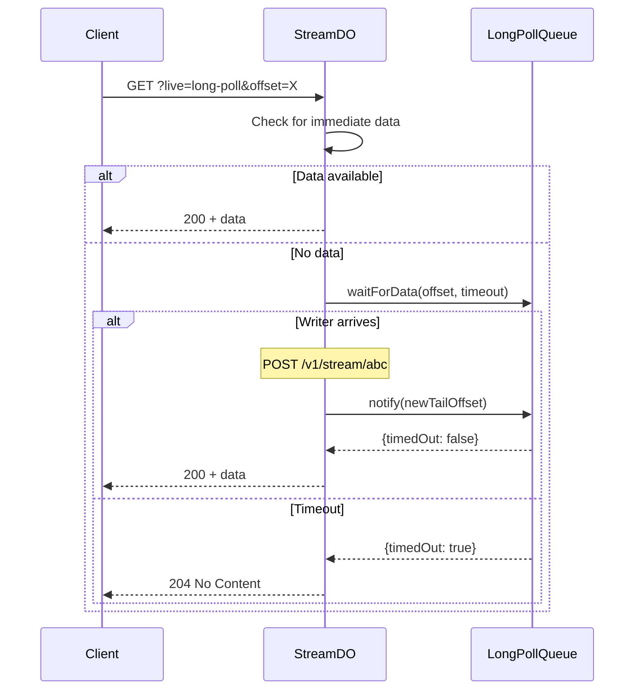
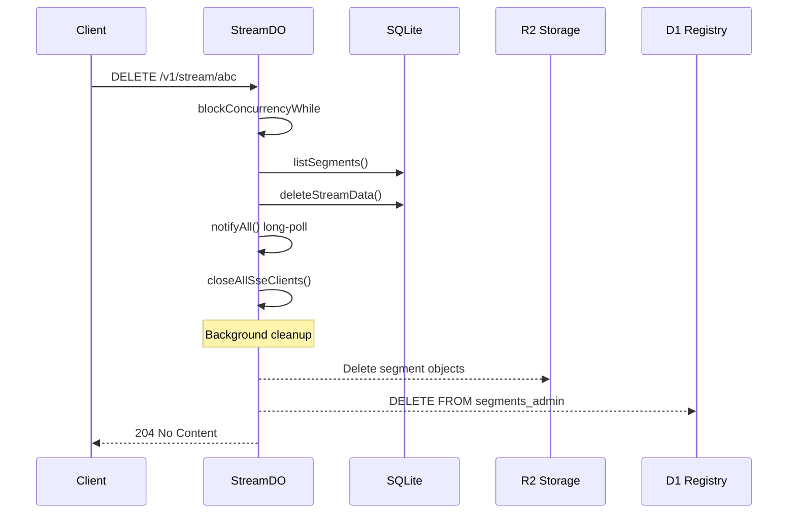

# Durable Streams Core

Data Flow Walkthrough

  
    Five stories showing how data moves through the system
  

---
layout: section
---

# Story 1: A Message is Written

Follow a PUT request from arrival to storage

---

# 1. The Request Arrives

A client sends: `PUT /v1/stream/user-123`

<<< @/../src/http/worker.ts#L179-L196 ts

The worker parses the URL, determines if it's a stream read, and validates authorization.

---

# 2. Authorizing the Request

<<< @/../src/http/worker.ts#L66-L75 ts

Bearer token auth is checked if `AUTH_TOKEN` is configured. Returns `{ ok: true }` on success.

---

# 3. Extracting the Stream ID

<<< @/../src/http/worker.ts#L232-L239 ts

The stream ID is extracted from the path and validated.

---

# 4. Routing to the Durable Object

<<< @/../src/http/worker.ts#L256-L279 ts

Every stream maps to exactly one Durable Object instance. The stream ID becomes a deterministic DO name via `idFromName()`.

---

# 5. Inside the Durable Object

<<< @/../src/http/durable_object.ts#L36-L56 ts

The DO extracts the stream ID from the `X-Stream-Id` header (set by the worker) and builds a context object.

---

# 6. Building the Context

<<< @/../src/http/durable_object.ts#L64-L85 ts

The context includes storage, SSE/long-poll state, and functions for offset encoding and segment rotation.

---

# 7. The Router

<<< @/../src/http/router.ts#L99-L122 ts

Requests are routed by HTTP method to the appropriate handler.

---

# 8. Handling PUT (Stream Creation)

<<< @/../src/http/handlers/write.ts#L55-L86 ts

PUT creates or updates a stream. Everything runs inside `blockConcurrencyWhile` for consistency.

---

# 9. Handling POST (Append Messages)

<<< @/../src/http/handlers/write.ts#L88-L127 ts

POST appends messages. Producer headers enable duplicate detection via epoch/seq tracking.

---

# 10. Side Effects After Mutation

<<< @/../src/http/handlers/write.ts#L137-L171 ts

After storing, the handler notifies long-poll waiters, broadcasts to SSE clients, and triggers segment rotation.

---

# The Write Path

---
layout: section
---

# Story 2: A Client Reads Messages

Follow a GET request for historical data

---

# 1. Read Authorization (JWT)

For reads, the worker can validate JWT tokens for session-based access:

<<< @/../src/http/worker.ts#L133-L148 ts

JWT claims include `session_id` and `exp` (expiry timestamp).

---

# 2. Cache Mode Resolution

<<< @/../src/http/router.ts#L75-L87 ts

Cache mode determines if responses can be CDN-cached (shared) or must be private.

---

# 3. Handling GET

<<< @/../src/http/handlers/read.ts#L75-L94 ts

GET first checks for live modes (SSE, long-poll), then falls back to direct read.

---

# 4. Resolving the Offset

<<< @/../src/http/handlers/read.ts#L96-L133 ts

The offset can be `-1` (start), `now` (tail), or an encoded cursor. Data is read up to `MAX_CHUNK_BYTES`.

---

# 5. Building the Response

<<< @/../src/http/handlers/read.ts#L124-L148 ts

Response includes ETag, cache headers, and the next offset for pagination.

---

# The Read Path

---
layout: section
---

# Story 3: Long-Polling for Updates

Follow a long-poll request from wait to data delivery

---

# 1. Long-Poll Handler Setup

<<< @/../src/http/handlers/realtime.ts#L171-L207 ts

The handler validates the offset, resolves cache mode, and checks for closed streams at tail.

---

# 2. Checking for Immediate Data

<<< @/../src/http/handlers/realtime.ts#L209-L222 ts

If data is immediately available, return it without waiting.

---

# 3. The Waiting Game

<<< @/../src/http/handlers/realtime.ts#L224-L259 ts

If no data available, wait up to `LONG_POLL_TIMEOUT_MS` (default 30s). On timeout, return 204.

---

# 4. The Long-Poll Queue

<<< @/../src/http/handlers/realtime.ts#L55-L93 ts

Waiters register with their current offset. When new data arrives, `notify()` wakes waiters.

---

# The Long-Poll Path

---
layout: section
---

# Story 4: A Client Listens via SSE

Follow an SSE connection from open to message delivery

---

# 1. SSE Mode Detection

<<< @/../src/http/handlers/read.ts#L87-L94 ts

The `live` query parameter determines streaming mode: `sse` or `long-poll`.

---

# 2. Setting Up SSE

<<< @/../src/http/handlers/realtime.ts#L266-L310 ts

A TransformStream is created, and the client is registered with a unique ID.

---

# 3. SSE Client Lifecycle

<<< @/../src/http/handlers/realtime.ts#L312-L330 ts

Each client gets a close timer (55 seconds) and the response stream is returned.

---

# 4. Broadcasting to SSE Clients

<<< @/../src/http/handlers/realtime.ts#L336-L357 ts

When messages are written, `broadcastSse` pushes to all connected clients.

---

# 5. SSE Event Format

<<< @/../src/http/handlers/realtime.ts#L99-L115 ts

Data events are encoded as standard SSE format. Binary content is base64-encoded.

---

# 6. SSE Control Events

<<< @/../src/http/handlers/realtime.ts#L117-L143 ts

Control events include the next offset, up-to-date status, and cursor for resume.

---

# The Real-Time Path

---
layout: section
---

# Story 5: Deleting a Stream

Follow a DELETE request through cascade cleanup

---

# 1. The Delete Handler

<<< @/../src/http/handlers/write.ts#L175-L205 ts

DELETE cascades through all storage layers: SQLite ops → R2 segments → D1 admin registry.

---

# 2. Notify Connected Clients

When a stream is deleted, both long-poll waiters and SSE clients are notified immediately:

- `longPoll.notifyAll()` wakes all waiting clients
- `closeAllSseClients()` cleanly closes SSE connections

---

# The Delete Path

---
layout: section
---

# Supporting Topics

---

# Offset Encoding

<<< @/../src/protocol/offsets.ts#L1-L12 ts

Offsets encode both the byte offset and read sequence (for segment lookups).

---

# Offset Decoding

<<< @/../src/protocol/offsets.ts#L14-L28 ts

---

# Segment Rotation

<<< @/../src/stream/rotate.ts#L21-L49 ts

Segments rotate when they exceed size or message count thresholds.

---

# Segment Storage

<<< @/../src/stream/rotate.ts#L70-L95 ts

Messages are serialized to R2, then ops are deleted from SQLite.

---

# Producer Deduplication (Types)

<<< @/../src/stream/producer.ts#L15-L26 ts

Producers provide idempotency through epoch/sequence tracking.

---

# Producer Deduplication (State Machine)

<<< @/../src/stream/producer.ts#L54-L102 ts

The state machine handles: new producer, epoch bump, duplicate, sequence gap.

---

# R2 Cold Storage - The ReadPath Class

<<< @/../src/stream/read/path.ts#L35-L47 ts

ReadPath provides a unified read interface with coalescing and caching.

---

# R2 Cold Storage - Segment Lookup

<<< @/../src/stream/read/path.ts#L123-L155 ts

When offset is below `segment_start`, read from R2 segments instead of SQLite.

---

# R2 Cold Storage - Decoding Segments

<<< @/../src/stream/read/path.ts#L193-L245 ts

Segment data is fetched from R2, then decoded and filtered by offset.

---

# HEAD Endpoint (Metadata Queries)

The HEAD method returns stream metadata without body content:

- `Stream-Next-Offset`: Current tail offset (encoded)
- `Stream-Closed`: Whether the stream is closed
- `Content-Type`: The stream's content type
- `ETag`: Current state hash for caching

Useful for checking stream existence or polling for state changes.

---

# Error Responses

<<< @/../src/protocol/errors.ts#L1-L6 ts

All errors use consistent headers and format.

---
layout: center
class: text-center
---

# Questions?

[Source Code](../src) | [Subscriptions](../../durable-stream-subscriptions/docs/walkthrough.md) | [Admin](../../durable-stream-admin/docs/walkthrough.md)

  
    Navigate: Arrow keys | Overview: O | Exit: Esc
  

