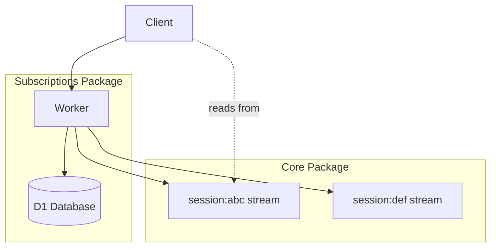
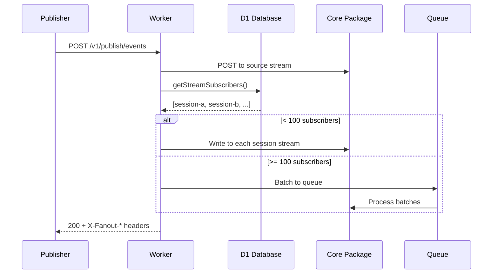

# Durable Streams Subscriptions

Data Flow Walkthrough

<div class="pt-12">
  <span class="px-2 py-1 rounded bg-gray-100">
    Three stories: Session creation, subscribing, and fanout
  </span>
</div>

---
layout: section
---

# Story 1: A Session is Created

Follow session creation from request to storage

---

# 1. The Worker Entry Point

<<< @/../src/worker.ts#L1-L18 ts

The Hono app defines the environment with D1, Core URL, and optional queue for high-volume fanout.

---

# 2. Middleware Stack

<<< @/../src/worker.ts#L22-L45 ts

CORS allows all origins. Optional bearer auth is checked if `AUTH_TOKEN` is configured.

---

# 3. Subscribe Route (Creates Sessions)

<<< @/../src/routes/subscribe.ts#L38-L50 ts

Sessions are created lazily on first subscribe. The `sessionId` and `streamId` come from the request body.

---

# 4. Creating the Session Stream in Core

<<< @/../src/routes/subscribe.ts#L52-L68 ts

The session stream is created in Core first (source of truth), then D1 records the session.

---

# 5. Creating Session Stream (Implementation)

<<< @/../src/fanout.ts#L168-L184 ts

Uses `fetchFromCore` which prefers service binding over HTTP for better performance.

---

# 6. Recording in D1

<<< @/../src/storage.ts#L15-L29 ts

D1 stores session metadata with `ON CONFLICT DO UPDATE` for idempotency.

---

# 7. The Response

<<< @/../src/routes/subscribe.ts#L82-L96 ts

Returns the session stream path - that's where clients read their messages.

---

# Session Architecture



---
layout: section
---

# Story 2: A Session Subscribes to a Stream

Follow subscription creation

---

# 1. Subscribe Schema

<<< @/../src/routes/subscribe.ts#L25-L34 ts

Subscriptions link a session to a source stream.

---

# 2. Adding a Subscription

<<< @/../src/storage.ts#L57-L75 ts

Subscription is added with `ON CONFLICT DO NOTHING` - re-subscribing is safe (idempotent).

---

# 3. Getting Subscribers for a Stream

<<< @/../src/storage.ts#L99-L108 ts

This query powers fanout - get all sessions subscribed to a stream.

---

# Subscription Data Model

```mermaid
erDiagram
    sessions ||--o{ subscriptions : has
    subscriptions }o--|| streams : "subscribes to"

    sessions {
        string session_id PK
        int created_at
        int last_active_at
        int ttl_seconds
        int marked_for_deletion_at
    }

    subscriptions {
        string session_id PK_FK
        string stream_id PK
        int subscribed_at
    }
```

---

# 4. Unsubscribe Flow

<<< @/../src/routes/subscribe.ts#L98-L112 ts

DELETE `/unsubscribe` removes a subscription. The session remains active.

---

# 5. Querying Session Details

<<< @/../src/routes/session.ts#L19-L43 ts

GET `/session/:sessionId` returns session info and all subscriptions.

---

# 6. Touch (Extend TTL)

<<< @/../src/routes/session.ts#L45-L68 ts

POST `/session/:sessionId/touch` extends the session's TTL by updating `last_active_at`.

---
layout: section
---

# Story 3: A Message is Published and Fanned Out

Follow a message from publish to all subscribers

---

# 1. The Publish Route

<<< @/../src/routes/publish.ts#L12-L35 ts

Publisher sends message to stream. Producer headers enable deduplication.

---

# 2. Write to Source Stream

<<< @/../src/routes/publish.ts#L36-L51 ts

Message is written to the source stream in Core first.

---

# 3. Fanout to Subscribers

<<< @/../src/routes/publish.ts#L66-L89 ts

After writing, fanout delivers to all subscribed sessions. Response includes fanout stats.

---

# 4. The Fanout Decision

<<< @/../src/fanout.ts#L25-L42 ts

Get subscribers from D1. If count > threshold (default 100) and queue available, use queue.

---

# 5. Queue-Based Fanout

<<< @/../src/fanout.ts#L42-L66 ts

High subscriber counts batch messages to Cloudflare Queues (100 per batch).

---

# 6. Inline Fanout

<<< @/../src/fanout.ts#L68-L103 ts

Low subscriber counts use `Promise.allSettled` for parallel delivery.

---

# 7. Queue Consumer

<<< @/../src/fanout.ts#L215-L267 ts

Queue consumer handles retries: 5xx errors retry with backoff, 4xx errors ack to prevent loops.

---

# 8. Worker Queue Handler

<<< @/../src/worker.ts#L126-L142 ts

The worker's queue handler processes batches and records metrics.

---

# The Fanout Path



---
layout: section
---

# Supporting Topics

---

# Two-Phase Session Cleanup

<<< @/../src/cleanup.ts#L26-L42 ts

Phase 1 marks expired sessions. Phase 2 deletes after grace period.

---

# Phase 2: Deleting Sessions

<<< @/../src/cleanup.ts#L54-L77 ts

Deletes session streams from Core, then removes D1 records.

---

# Marking Expired Sessions

<<< @/../src/storage.ts#L149-L163 ts

Sessions past their TTL are marked with timestamp.

---

# Getting Sessions to Delete

<<< @/../src/storage.ts#L167-L185 ts

Only delete sessions marked longer than grace period AND still expired.

---

# Touching Sessions (Prevents Deletion)

<<< @/../src/storage.ts#L39-L48 ts

Touch clears the deletion mark - prevents race conditions during cleanup.

---

# Scheduled Cleanup

<<< @/../src/worker.ts#L96-L124 ts

Runs every 5 minutes via cron. Records cleanup metrics.

---

# Metrics: Fanout & Queue Events

<<< @/../src/metrics.ts#L9-L50 ts

Tracks fanout success/failure rates, queue batch processing, and retry attempts.

---

# Metrics: Session Lifecycle

<<< @/../src/metrics.ts#L69-L100 ts

Records session creation, touch, delete, and expiration events.

---

# Metrics: Cleanup & HTTP Events

<<< @/../src/metrics.ts#L102-L141 ts

Tracks cleanup batches, HTTP request latency, and publish operations.

---

# Metrics Event Types

| Category | Events | Doubles |
|----------|--------|---------|
| `fanout` | Per-message fanout | subscribers, success, failures |
| `queue` | Queue batch processing | size, success, retries |
| `subscription` | Subscribe/unsubscribe | count, latency, isNewSession |
| `session` | Create/touch/delete/expire | count, latency, ttl/age |
| `cleanup` | Two-phase cleanup | marked, deleted, success, fail |
| `publish` | Message publish | count, fanoutCount, latency |

Queryable via Analytics Engine SQL.

---
layout: center
class: text-center
---

# Questions?

[Source Code](../src) | [Core](../../durable-stream-core/docs/walkthrough.md) | [Admin](../../durable-stream-admin/docs/walkthrough.md)

<div class="pt-12">
  <span class="px-2 py-1 rounded bg-gray-100">
    Navigate: Arrow keys | Overview: O | Exit: Esc
  </span>
</div>
