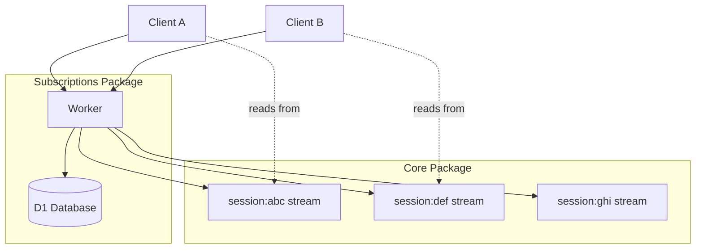
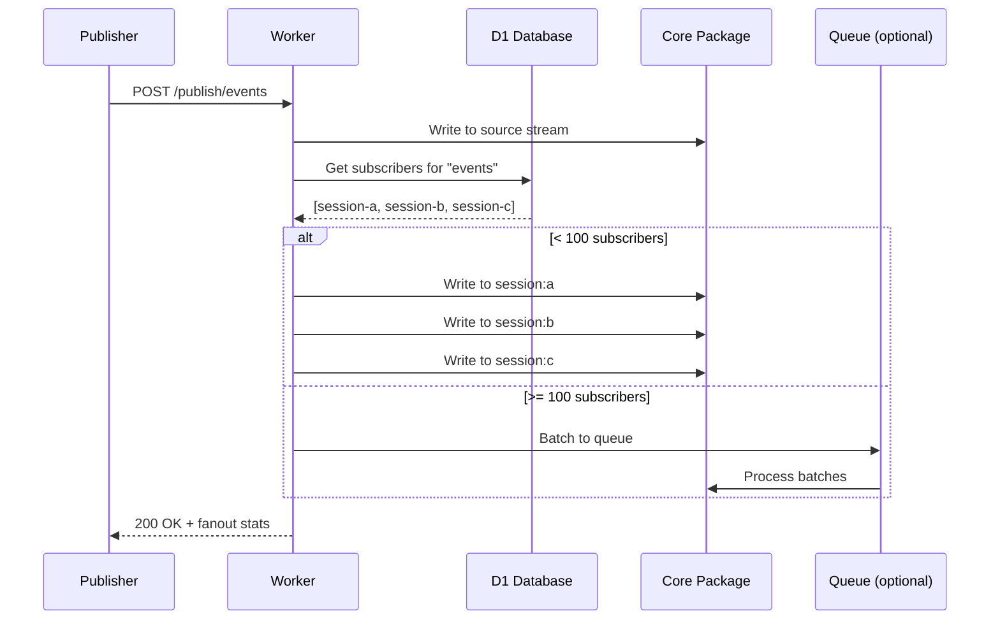

# Durable Streams Subscriptions

Data Flow Walkthrough

<div class="pt-12">
  <span class="px-2 py-1 rounded bg-gray-100">
    Three stories: Session creation, subscribing, and fanout
  </span>
</div>

---
layout: section
---

# Story 1: A Session is Created

Follow session creation from request to storage

---

# 1. The Request

A client sends: `POST /v1/subscribe` with a new session ID

```ts {all|4-9|11-15}
// src/routes/subscribe.ts - Subscribe implicitly creates sessions
app.post("/subscribe", zValidator("json", subscribeSchema), async (c) => {
  const { sessionId, streamId, contentType } = c.req.valid("json");
  const env = c.env;

  // Check if session already exists in D1
  const existingSession = await getSession(env.DB, sessionId);

  if (!existingSession) {
    // New session - need to create it in both D1 and Core
    const ttlSeconds = env.SESSION_TTL_SECONDS ?? 1800; // 30 min default

    // Create the session stream in Core first
    await createSessionStreamWithEnv(env, sessionId, contentType, ttlSeconds);

    // Then record in D1
    await createSession(env.DB, sessionId, ttlSeconds);
  }
  // ...
});
```

Sessions are created lazily on first subscribe. Each session gets its own stream in Core.

---

# 2. Creating in Core

```ts {all|3-9|11-16}
// src/fanout.ts - Create the session's message stream
export async function createSessionStreamWithEnv(
  env: Env,
  sessionId: string,
  contentType: string,
  ttlSeconds: number
): Promise<void> {
  // Session streams use a "session:" prefix
  const path = `/v1/stream/session:${sessionId}`;

  // Set expiry so stream auto-deletes when session TTL expires
  const expiresAt = Date.now() + ttlSeconds * 1000;

  const response = await fetchFromCore(env, path, {
    method: "PUT",
    headers: {
      "Content-Type": contentType,
      "X-Stream-Expires-At": expiresAt.toString(),
    }
  });
  if (!response.ok) throw new Error(`Failed to create session stream`);
}
```

The session stream in Core holds all messages fanned out to this session.

---

# 3. Recording in D1

```ts {all|3-10|12-17}
// src/storage.ts - Insert session record
export async function createSession(
  db: D1Database,
  sessionId: string,
  ttlSeconds: number
): Promise<void> {
  const now = Date.now();
  await db.prepare(`
    INSERT INTO sessions (session_id, created_at, last_active_at, ttl_seconds)
    VALUES (?, ?, ?, ?)
    ON CONFLICT (session_id) DO UPDATE SET last_active_at = ?
  `).bind(sessionId, now, now, ttlSeconds, now).run();
}

// D1 tracks:
// - session_id: unique identifier
// - created_at: when session started
// - last_active_at: for TTL expiry calculation
// - ttl_seconds: how long until session expires
// - marked_for_deletion_at: soft-delete timestamp (2-phase cleanup)
```

D1 is the source of truth for session existence and subscriptions.

---

# 4. The Response

```ts {all|3-10|12-16}
// After session creation, add the subscription and respond
await addSubscription(env.DB, sessionId, streamId);

// Record metrics
metrics.subscribe(streamId, sessionId, /* isNewSession */ true, latency);

// Return session info with computed expiry
const sessionInfo = {
  sessionId,
  createdAt: now,
  lastActiveAt: now,
  ttlSeconds,
  expiresAt: now + ttlSeconds * 1000,
  sessionStreamPath: `/v1/stream/session:${sessionId}`,
  subscriptions: [{ streamId, subscribedAt: now }],
};

return c.json(sessionInfo, 201);
```

The client receives the session stream path - that's where they'll read their messages.

---

# Session Architecture



Each session has its own stream in Core. D1 tracks which sessions exist.

---
layout: section
---

# Story 2: A Session Subscribes to a Stream

Follow subscription creation

---

# 1. The Subscribe Request

A client sends: `POST /v1/subscribe`

```ts {all|3-8|10-14}
// src/routes/subscribe.ts
const subscribeSchema = z.object({
  sessionId: z.string().min(1),
  streamId: z.string().min(1),
  contentType: z.string().default("application/json"),
});

app.post("/subscribe", zValidator("json", subscribeSchema), async (c) => {
  const { sessionId, streamId } = c.req.valid("json");

  // Validate session exists (or create it - see Story 1)
  const session = await getSession(c.env.DB, sessionId);
  if (!session) {
    // Create session first...
  }
  // ...
});
```

Subscription links a session to a source stream. The session will receive messages published to that stream.

---

# 2. Recording the Subscription

```ts {all|3-10|12-16}
// src/storage.ts - Link session to stream
export async function addSubscription(
  db: D1Database,
  sessionId: string,
  streamId: string
): Promise<void> {
  const now = Date.now();
  await db.prepare(`
    INSERT INTO subscriptions (session_id, stream_id, subscribed_at)
    VALUES (?, ?, ?)
    ON CONFLICT (session_id, stream_id) DO NOTHING
  `).bind(sessionId, streamId, now).run();
}

// Idempotent: re-subscribing is safe
// The ON CONFLICT DO NOTHING means duplicate subscribes are no-ops
// Primary key is (session_id, stream_id)
```

Subscriptions are stored in D1. The constraint prevents duplicate entries.

---

# 3. The Response

```ts {all|3-9|11-14}
// Return updated session info
const subscriptions = await getSessionSubscriptions(env.DB, sessionId);

const response = {
  sessionId,
  subscriptions: subscriptions.map(s => ({
    streamId: s.stream_id,
    subscribedAt: s.subscribed_at,
  })),
  // ... other session fields
};

return c.json(response, 200);

// Client now reads from /v1/stream/session:{sessionId} in Core
// All messages from subscribed streams will appear there
```

The client can now read from their session stream to receive messages from all subscribed streams.

---

# Subscription Data Model

```mermaid
erDiagram
    sessions ||--o{ subscriptions : has
    subscriptions }o--|| streams : "subscribes to"

    sessions {
        string session_id PK
        int created_at
        int last_active_at
        int ttl_seconds
        int marked_for_deletion_at
    }

    subscriptions {
        string session_id PK,FK
        string stream_id PK
        int subscribed_at
    }

    streams {
        string stream_id
        note "Lives in Core package"
    }
```

---
layout: section
---

# Story 3: A Message is Published and Fanned Out

Follow a message from publish to all subscribers

---

# 1. The Publish Request

A client sends: `POST /v1/publish/events`

```ts {all|4-9|11-15}
// src/routes/publish.ts
app.post("/publish/:streamId", async (c) => {
  const streamId = c.req.param("streamId");
  const payload = await c.req.arrayBuffer();
  const contentType = c.req.header("Content-Type") ?? "application/json";

  // Optional producer headers for idempotency
  const producerHeaders = {
    producerId: c.req.header("Producer-Id"),
    epoch: c.req.header("Producer-Epoch"),
    seq: c.req.header("Producer-Seq"),
  };

  // Write to the source stream first
  await writeToSourceStream(c.env, streamId, payload, contentType, producerHeaders);
  // ...
});
```

The message first goes to the source stream, then fans out to subscribers.

---

# 2. Finding Subscribers

```ts {all|3-8|10-14}
// src/storage.ts - Query subscribers for a stream
export async function getStreamSubscribers(
  db: D1Database,
  streamId: string
): Promise<string[]> {
  const result = await db.prepare(`
    SELECT session_id FROM subscriptions WHERE stream_id = ?
  `).bind(streamId).all();

  return result.results.map(r => r.session_id as string);
}

// Index on stream_id makes this fast
// CREATE INDEX idx_subscriptions_by_stream
//   ON subscriptions(stream_id)
```

D1 gives us all session IDs subscribed to this stream.

---

# 3. The Fanout Decision

```ts {all|4-9|11-17}
// src/fanout.ts - Choose fanout strategy based on subscriber count
const FANOUT_THRESHOLD = 100;

export async function fanOutToSubscribers(
  env: Env,
  streamId: string,
  payload: ArrayBuffer,
  contentType: string
): Promise<FanoutResult> {
  const sessionIds = await getStreamSubscribers(env.DB, streamId);

  if (sessionIds.length <= FANOUT_THRESHOLD) {
    // Small fanout: do it inline with Promise.allSettled
    return inlineFanout(env, sessionIds, payload, contentType);
  } else {
    // Large fanout: batch to Cloudflare Queues
    return queueFanout(env, streamId, sessionIds, payload, contentType);
  }
}
```

**< 100 subscribers:** Inline with `Promise.allSettled`
**>= 100 subscribers:** Queue-based batching for scale

---

# 4. Inline Fanout

```ts {all|3-10|12-18}
// src/fanout.ts - Direct fanout for small subscriber counts
async function inlineFanout(
  env: Env,
  sessionIds: string[],
  payload: ArrayBuffer,
  contentType: string
): Promise<FanoutResult> {
  // Write to all session streams in parallel
  const results = await Promise.allSettled(
    sessionIds.map(sessionId =>
      writeToSessionStreamWithEnv(env, sessionId, payload, contentType)
    )
  );

  // Count successes and failures
  const successes = results.filter(r => r.status === "fulfilled").length;
  const failures = results.filter(r => r.status === "rejected").length;

  return { fanoutCount: sessionIds.length, successes, failures };
}
```

Each session stream gets the message written to it in Core.

---

# 5. Queue Fanout

```ts {all|4-12|14-20}
// src/fanout.ts - Batch to queues for large fanouts
async function queueFanout(
  env: Env,
  streamId: string,
  sessionIds: string[],
  payload: ArrayBuffer,
  contentType: string
): Promise<FanoutResult> {
  // Encode payload for queue transport
  const base64Payload = arrayBufferToBase64(payload);

  // Batch into queue messages (100 sessions per batch)
  const batches = chunk(sessionIds, 100);
  for (const batch of batches) {
    await env.FANOUT_QUEUE.send({
      streamId,
      sessionIds: batch,
      payload: base64Payload,
      contentType,
    });
  }

  return { fanoutCount: sessionIds.length, queued: true };
}
```

Queues handle backpressure and retries for high-volume fanouts.

---

# 6. Queue Consumer

```ts {all|4-11|13-20}
// src/worker.ts - Process queue batches
export default {
  async queue(batch: MessageBatch, env: Env): Promise<void> {
    for (const msg of batch.messages) {
      const { sessionIds, payload, contentType } = msg.body;
      const payloadBuffer = base64ToArrayBuffer(payload);

      for (const sessionId of sessionIds) {
        try {
          await writeToSessionStreamWithEnv(env, sessionId, payloadBuffer, contentType);
          msg.ack();
        } catch (e) {
          // Retry logic
          if (isRetryable(e)) {
            msg.retry({ delaySeconds: 5 });
          } else {
            msg.ack(); // Don't retry 4xx errors
          }
        }
      }
    }
  }
}
```

Queue consumer retries 5xx errors, acknowledges 4xx to prevent infinite loops.

---

# 7. Delivery Complete

```ts {all|3-9|11-15}
// After fanout, respond with stats
const result = await fanOutToSubscribers(
  c.env, streamId, payload, contentType, producerHeaders
);

// Add fanout stats to response headers
c.header("X-Fanout-Count", result.fanoutCount.toString());
c.header("X-Fanout-Successes", result.successes.toString());
c.header("X-Fanout-Failures", result.failures.toString());

// Clients reading their session streams will see the message
// GET /v1/stream/session:{sessionId}?live=sse
// or
// GET /v1/stream/session:{sessionId}?offset=...

return c.json({ published: true }, 200);
```

Each session stream now has the message. Clients use Core's read APIs to receive it.

---

# The Fanout Path



---
layout: section
---

# Supporting Topics

Session lifecycle and observability

---

# Session Cleanup

Two-phase deletion prevents race conditions

```ts {all|4-9|11-18}
// src/cleanup.ts - Scheduled every 5 minutes
export async function cleanupExpiredSessions(env: CleanupEnv): Promise<void> {
  // Phase 1: Mark expired sessions
  // Sets marked_for_deletion_at = now
  await markExpiredSessions(env.DB);

  // Grace period: 60 seconds
  // If session is touched during this window, mark is cleared

  // Phase 2: Delete sessions still marked after grace period
  const toDelete = await getSessionsToDelete(env.DB, GRACE_PERIOD_MS);

  for (const sessionId of toDelete) {
    // Delete from Core first
    await deleteSessionStreamWithEnv(env, sessionId);
    // Then delete from D1 (session + subscriptions)
    await deleteSession(env.DB, sessionId);
  }
}
```

**Why two-phase?** A session touched while marked gets unmarked, avoiding deletion of active sessions.

---

# Metrics

Analytics Engine integration for observability

```ts {all|4-10|12-18}
// src/metrics.ts - Record operations
export class Metrics {
  constructor(private dataset?: AnalyticsEngineDataset) {}

  fanout(streamId: string, subs: number, success: number, fail: number, latency: number) {
    this.dataset?.writeDataPoint({
      blobs: [streamId, "", "fanout", ""],
      doubles: [subs, success, fail, latency],
      indexes: ["fanout"],
    });
  }

  // Other tracked events:
  // - subscribe/unsubscribe
  // - sessionCreate/sessionTouch/sessionDelete
  // - publish/publishError
  // - cleanupBatch (scheduled cleanup stats)
  // - queueBatch/queueRetry
  // - http (endpoint, method, status, latency)
}
```

Every operation is tracked with latency and outcome for debugging.

---
layout: center
class: text-center
---

# Questions?

[Subscriptions Source](../src) | [Core Package](../../durable-stream-core/docs/walkthrough.md)

<div class="pt-12">
  <span class="px-2 py-1 rounded bg-gray-100">
    Navigate: Arrow keys | Overview: O | Exit: Esc
  </span>
</div>
