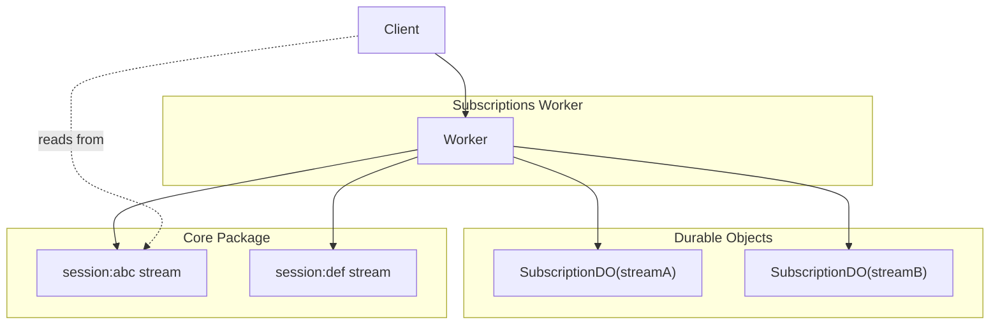
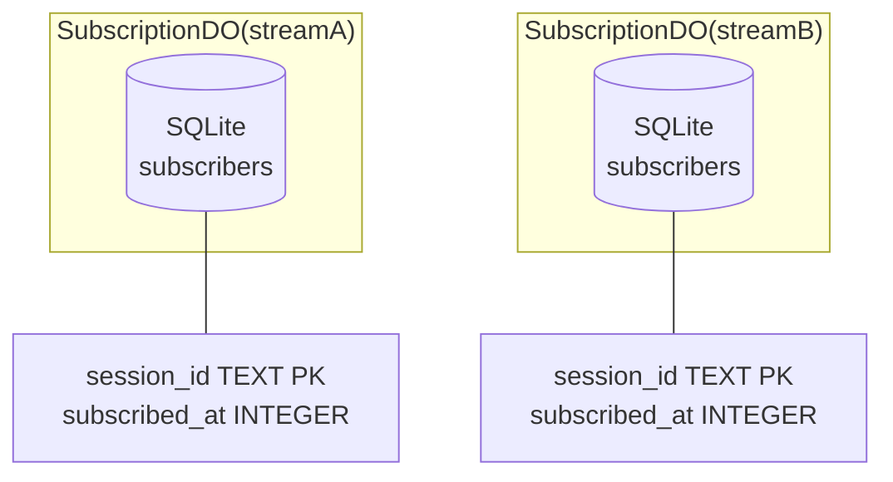
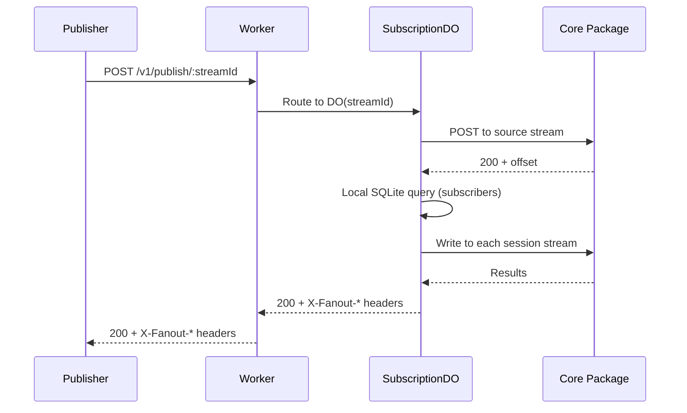

# Durable Streams Subscriptions

Data Flow Walkthrough

  
    Three stories: Session creation, subscribing + fanout, and cleanup
  

---
layout: section
---

# Story 1: A Session is Created

Follow session creation from request to SubscriptionDO

---

# 1. The Worker Entry Point

<<< @/../src/http/worker.ts#L1-L25 ts

The Hono app defines the environment with `SUBSCRIPTION_DO`, optional `CORE` service binding, and configurable CORS via `CORS_ORIGINS`.

---

# 2. Middleware Stack

<<< @/../src/http/worker.ts#L57-L111 ts

CORS is configurable via `CORS_ORIGINS` (single origin, comma-separated list, or `*`). Optional bearer auth is checked if `AUTH_TOKEN` is set. HTTP metrics record every request.

---

# 3. Subscribe Route (Schema + Validation)

<<< @/../src/http/routes/subscribe.ts#L19-L28 ts

Zod schemas validate `sessionId` and `streamId` against `SESSION_ID_PATTERN` / `STREAM_ID_PATTERN` to prevent SQL injection in Analytics Engine queries.

---

# 4. Creating the Session Stream in Core

<<< @/../src/subscriptions/subscribe.ts#L15-L43 ts

The session stream is created in Core first (source of truth). Uses `X-Stream-Expires-At` to set TTL. A `409` means the stream already exists — that's fine.

---

# 5. Adding Subscription to SubscriptionDO

<<< @/../src/subscriptions/subscribe.ts#L45-L60 ts

Routes to `SubscriptionDO(streamId)` via `idFromName`. The DO stores the subscriber in local SQLite. If the DO call fails, the session stream is rolled back.

---

# 6. The Response

<<< @/../src/subscriptions/subscribe.ts#L69-L76 ts

Returns the session stream path, expiry timestamp, and whether this was a new session.

---

# Session Architecture

---
layout: section
---

# Story 2: A Session Subscribes to a Stream

Focus on SubscriptionDO internals

---

# 1. SubscriptionDO Overview

<<< @/../src/subscriptions/do.ts#L1-L41 ts

Each stream gets its own SubscriptionDO with a local SQLite `subscribers` table. `blockConcurrencyWhile` ensures the schema is initialized before any requests.

---

# 2. Adding a Subscriber

<<< @/../src/subscriptions/do.ts#L42-L50 ts

`ON CONFLICT DO NOTHING` makes subscribe idempotent — re-subscribing the same session is a safe no-op.

---

# 3. Getting Subscribers

<<< @/../src/subscriptions/do.ts#L56-L66 ts

Subscriber lookup is a synchronous local SQLite query — no network hop.

---

# Subscription Data Model

Each stream's SubscriptionDO has its own isolated `subscribers(session_id, subscribed_at)` table.

---

# 4. Unsubscribe Flow

<<< @/../src/subscriptions/unsubscribe.ts#L10-L20 ts

The `unsubscribe()` function routes to `SubscriptionDO(streamId)` to remove the subscriber. The session itself remains active.

---

# 5. Session Info

<<< @/../src/session/index.ts#L17-L40 ts

`getSession()` does a HEAD request to Core to check if the session stream exists, then queries Analytics Engine for subscription data.

---

# 6. Touch (Extend TTL)

<<< @/../src/session/index.ts#L42-L63 ts

`touchSession()` extends the session's TTL by sending a PUT to Core with an updated `X-Stream-Expires-At` header.

---
layout: section
---

# Story 3: A Message is Published and Fanned Out

Follow a message from publish to all subscribers — no queue needed

---

# 1. The Publish Route

<<< @/../src/http/routes/publish.ts#L23-L54 ts

Validates `streamId` against `STREAM_ID_PATTERN`, then delegates entirely to `SubscriptionDO(streamId)`. Producer headers are passed through for deduplication.

---

# 2. SubscriptionDO: Write to Source Stream

<<< @/../src/subscriptions/do.ts#L68-L106 ts

The DO writes to the source stream in Core first (source of truth). The response's `X-Stream-Next-Offset` is used to build fanout producer headers for deduplication.

---

# 3. SubscriptionDO: Fanout

<<< @/../src/subscriptions/do.ts#L121-L160 ts

Local SQLite query gets all subscribers. `Promise.allSettled` delivers to all session streams in parallel. Stale subscribers (404 responses) are auto-removed from SQLite.

---

# 4. Stale Subscriber Cleanup

<<< @/../src/subscriptions/do.ts#L135-L155 ts

When a session stream returns 404 during fanout, the subscriber is immediately removed from local SQLite. This keeps the subscriber list clean without waiting for the cleanup cron.

---

# 5. Response with Fanout Headers

<<< @/../src/subscriptions/do.ts#L162-L178 ts

`X-Fanout-Count`, `X-Fanout-Successes`, and `X-Fanout-Failures` headers let the publisher know exactly what happened.

---

# The Fanout Path

---
layout: section
---

# Supporting Topics

---

# 1. Session Cleanup Overview

<<< @/../src/cleanup/index.ts#L1-L10 ts

Cleanup uses Analytics Engine to find expired sessions, removes their subscriptions from SubscriptionDOs, then deletes their session streams from Core. Single-phase — no marking/grace period.

---

# 2. Cleanup Implementation

<<< @/../src/cleanup/index.ts#L110-L188 ts

Queries Analytics Engine for expired sessions, then processes them in parallel batches of 10.

---

# 3. Removing Subscriptions + Deleting Streams

<<< @/../src/cleanup/index.ts#L47-L108 ts

For each expired session: query its subscriptions from Analytics Engine, remove from each SubscriptionDO, then delete the session stream from Core.

---

# 4. Scheduled Handler

<<< @/../src/http/worker.ts#L128-L162 ts

Runs every 5 minutes via cron. Records cleanup metrics including expired session count, stream deletes, and subscription removals.

---

# 5. Input Validation

<<< @/../src/constants.ts#L1-L17 ts

`SESSION_ID_PATTERN` and `STREAM_ID_PATTERN` restrict IDs to safe characters — preventing SQL injection in Analytics Engine queries where values are interpolated into SQL strings.

---

# 6. Core Client

<<< @/../src/client.ts#L16-L39 ts

`fetchFromCore` prefers the `CORE` service binding (no network hop, no auth needed). Falls back to HTTP with bearer auth if the binding isn't available.

---

# 7. Metrics Overview

<<< @/../src/metrics/index.ts#L1-L8 ts

All metrics use Analytics Engine with a consistent structure: `blobs` for dimensions, `doubles` for values, `indexes` for query filtering.

---

# 8. Metrics: Fanout & Subscription

<<< @/../src/metrics/index.ts#L9-L67 ts

Tracks fanout success/failure rates per stream, plus subscribe/unsubscribe events.

---

# 9. Metrics: Session Lifecycle & Cleanup

<<< @/../src/metrics/index.ts#L69-L141 ts

Records session creation, touch, delete, and expiration events. Cleanup batch metrics track streams deleted and subscriptions removed.

---

# Metrics Event Types

| Category | Events | Doubles |
|----------|--------|---------|
| `fanout` | Per-message fanout | subscribers, success, failures |
| `subscription` | Subscribe/unsubscribe | count, latency, isNewSession |
| `session` | Create/touch/delete/expire | count, latency, ttl/age |
| `cleanup` | Expired session cleanup | expired, streamsDeleted, subsRemoved, subsFailed |
| `publish` | Message publish | count, fanoutCount, latency |
| `http` | HTTP request metrics | count, latency |

Queryable via Analytics Engine SQL.

---
layout: center
class: text-center
---

# Questions?

[Source Code](../src) | [Core](../../durable-stream-core/docs/walkthrough.md) | [Admin](../../durable-stream-admin/docs/walkthrough.md)

  
    Navigate: Arrow keys | Overview: O | Exit: Esc
  

